# 🌸 Hanaya Shop

<details>
<summary><strong>🇯🇵 日本語</strong></summary>


## 目次

- [🔗 リンク](#links-jp)
- [🛠️ インストール/セットアップのご案内](#install-jp)
- [概要](#overview-jp)
- [🎯 プロジェクト目的](#goals-jp)
- [🌟 機能](#features-jp)
   - [👤 顧客向け](#customers-jp)
   - [🛠️ 管理者向け](#admin-section)
- [🛠️ 技術スタック](#tech-jp)
   - [💡 ハイライトと実運用効果](#highlights-jp)
- [🔄 CI/CD パイプライン](#cicd-jp)
- [📊 パフォーマンス測定結果](#パフォーマンス測定結果)
- [🗂️ ディレクトリ構成](#structure-jp)
- [🚀 今後の改善点](#future-jp)

## 🔗 リンク <a id="links-jp"></a>

<div align="center">
<table><tr>
<td align="center">🌐 <strong><a href="http://hanayashop.com">Hanaya Shop</a></strong></td>
<td align="center">🎬 <strong><a href="https://youtu.be/MLeE64xe4O0">YouTube デモ</a></strong></td>
</tr></table>
</div>

## 🎯 テスト用アカウント <a id="test-accounts-jp"></a>

**Hanaya Shopを登録前に体験してみてください！** 以下のテストアカウントを使用して、新しいアカウントを作成することなく、すべての顧客向け機能を完全無料でお試しいただけます。

| メールアドレス              | パスワード   | 備考                    |
|-----------------------------|-------------|------------------------|
| testuser0@gmail.com         | 123456789   | 完全無料でご利用可能      |
| testuser1@gmail.com         | 123456789   | 全機能をお試しできます    |
| testuser2@gmail.com         | 123456789   | お気軽にご体験ください    |
| testuser3@gmail.com         | 123456789   | 安心してご利用ください    |
| testuser4@gmail.com         | 123456789   | すべて無料です          |
| testuser5@gmail.com         | 123456789   | ご自由にお使いください    |
| testuser6@gmail.com         | 123456789   | 制限なくご利用可能      |
| testuser7@gmail.com         | 123456789   | 気軽にお試しください      |
| testuser8@gmail.com         | 123456789   | 完全フリーアクセス      |
| testuser9@gmail.com         | 123456789   | 無料体験アカウント      |

💡 **使用方法**: ログインページでいずれかのアカウントでログインし、商品閲覧・購入・チャットボット・多言語切替など、顧客向け機能を自由にお試しください。

## 🛠️ インストール/セットアップのご案内 <a id="install-jp"></a>

-   本番環境（Production）: [DEPLOYMENT_GUIDE.md](./%23GUIDE/DEPLOYMENT_GUIDE.md)
-   開発環境（Developing）: [README_DEV.md](./%23GUIDE/README_DEV.md)

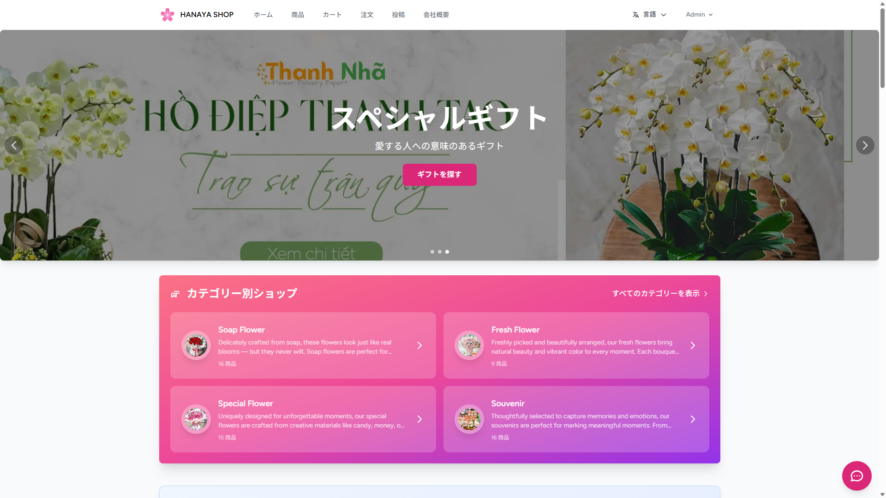
<div align="center">

_メインページのイメージ_

</div>

## 概要 <a id="overview-jp"></a>

ベトナムでは、特に祝祭期に、鮮度が短い花が売れ残り、価値を生む前に廃棄されてしまう課題が存在します。販売機会の逸失と需要とのミスマッチが、事業者の損失と社会的な無駄を生み出しています。

**Hanaya Shop**は、この「もったいない」をテクノロジーで減らすために生まれたオンライン・フラワーショップです。販売者の露出を広げ、顧客との接点を増やし、最適なタイミングで最適な顧客に花を届ける——そのためのプロダクトとして設計されています。直感的なUI/UX、堅牢な在庫・注文・決済ドメイン、運用に耐える管理機能を備え、将来的には販売者と顧客のマッチングをさらに高度化して、廃棄ゼロに近づけることを目指します。

<div align="center">


_花の廃棄問題の実態_

</div>

---

## 🎯 プロジェクト目的 <a id="goals-jp"></a>

-   現実の課題（廃棄）に向き合い、販売機会と需要のマッチングを最適化する
-   花屋向けにシンプルで拡張性の高いECプラットフォームを提供し、導入/運用コストを下げる
-   在庫・注文・決済の業務を安全に自動化し、人的ミスを減らす
-   管理者ダッシュボードで売上・在庫・人気商品などを可視化し、意思決定を高速化する
-   将来的な外部連携（決済、地図、通知、レコメンド）に備えた拡張性を確保する

---

## 🌟 機能 <a id="features-jp"></a>

### 👤 顧客向け <a id="customers-jp"></a>

-   商品一覧・詳細、カテゴリ/用途/価格のフィルタリング
-   ベストセラーや特価商品のハイライト表示
-   カート、注文作成、購入履歴
-   多言語切替（日本語/英語/ベトナム語）
-   注文ステータスに応じたメール通知
-   チャットボットによる購買サポート
-   直感的な住所選択（地図API連携）
-   多様な決済手段（代金引換、銀行カード、PayPal）

<div align="center">
<table>
<tr>
<td align="center" width="33%">
<a href=".github/images/jp/customer-features.png" target="_blank">
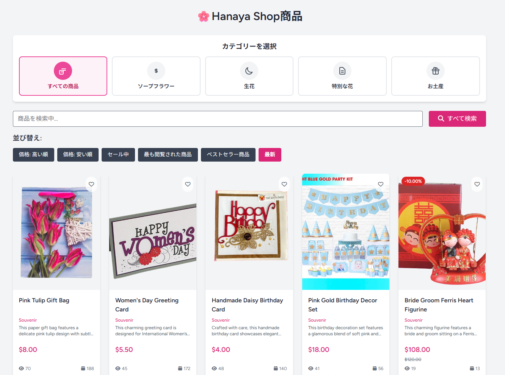
</a>
<br><i>商品一覧・フィルタリング機能</i>
</td>
<td align="center" width="33%">
<a href=".github/images/jp/customer-features2.png" target="_blank">
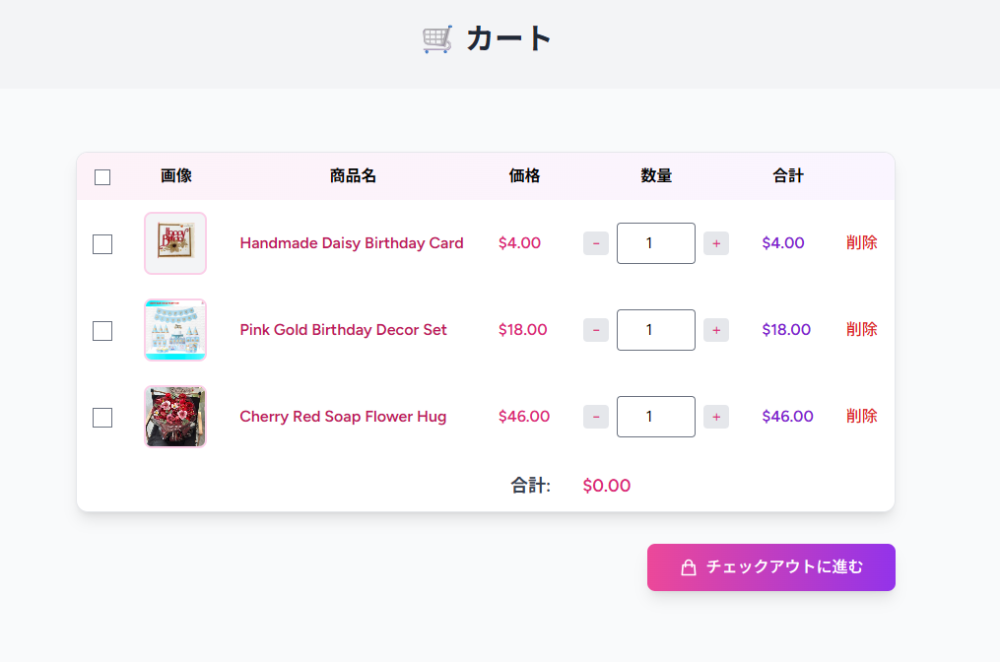
</a>
<br><i>商品詳細・レビュー機能</i>
</td>
<td align="center" width="33%">
<a href=".github/images/jp/customer-features3.png" target="_blank">
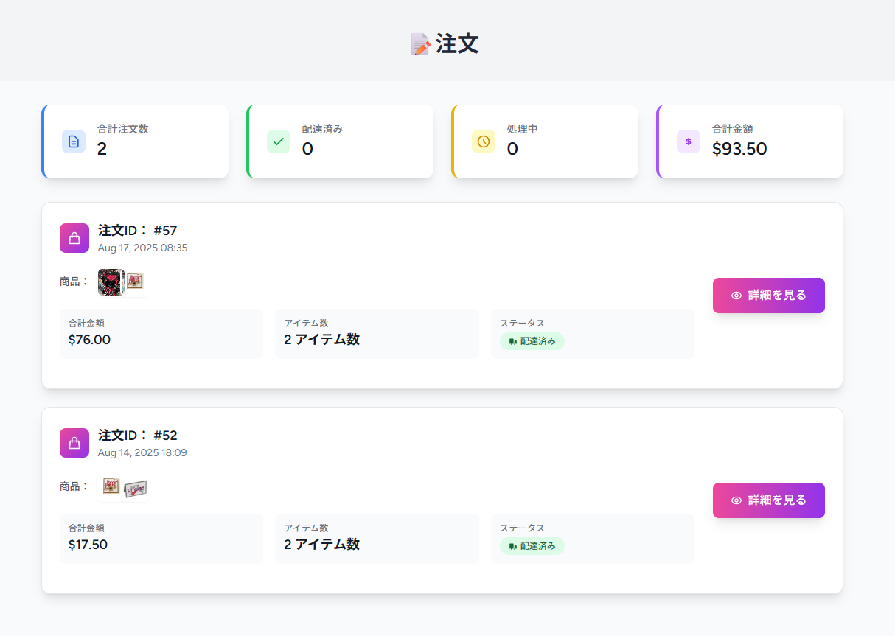
</a>
<br><i>カート・チェックアウト</i>
</td>
</tr>
<tr>
<td align="center" width="33%">
<a href=".github/images/jp/chat-bot.png" target="_blank">
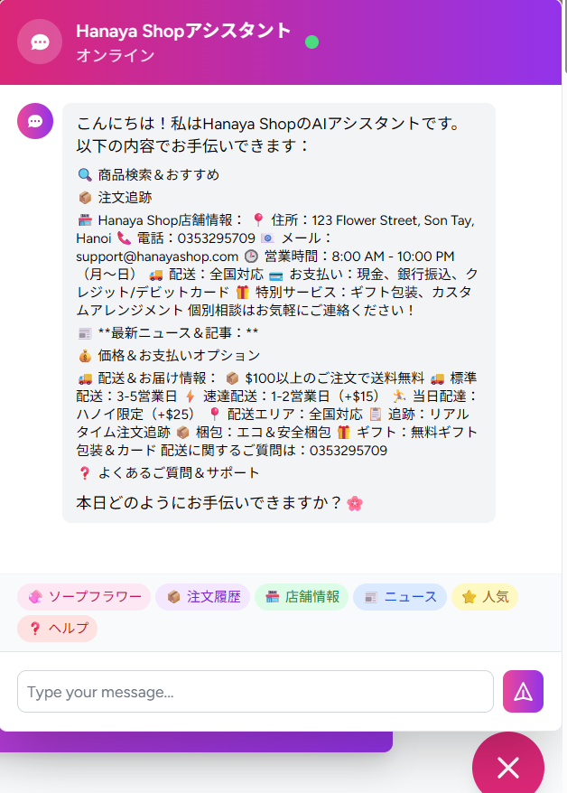
</a>
<br><i>AIチャットボットサポート</i>
</td>
<td align="center" width="33%">
<a href=".github/images/jp/email.png" target="_blank">

</a>
<br><i>メール通知システム</i>
</td>
<td align="center" width="33%">
<a href=".github/images/jp/multi-lang.png" target="_blank">
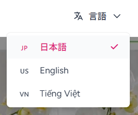
</a>
<br><i>多言語切り替え機能</i>
</td>
</tr>
</table>
</div>


### 🛠️ 管理者向け <a id="admin-section"></a>

-   商品カテゴリ・商品 CRUD（表示/非表示切替含む）
-   注文の承認/キャンセル/ステータス更新、効率的な処理 UI
-   在庫監視（売り切れ/閾値接近の把握）
-   月次売上などのダッシュボード指標・統計
-   顧客管理、購入傾向の把握

<div align="center">
<table>
<tr>
<td align="center" width="50%">
<a href=".github/images/jp/admin-dashboard.png" target="_blank">
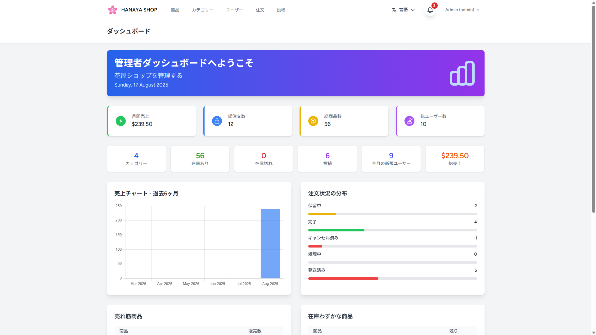
</a>
<br><i>管理者ダッシュボード・統計</i>
</td>
<td align="center" width="50%">
<a href=".github/images/jp/order.png" target="_blank">
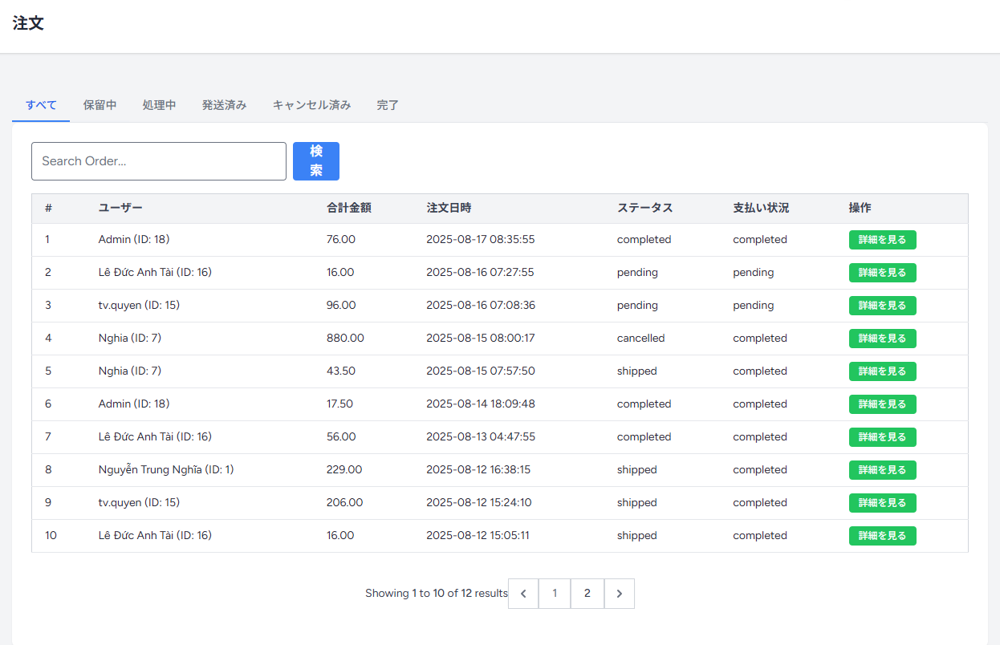
</a>
<br><i>注文管理・処理画面</i>
</td>
</tr>
</table>
</div>

---

## 🛠️ 技術スタック <a id="tech-jp"></a>

| 技術           | 目的                           |
| -------------- | ------------------------------ |
| PHP 8.2        | バックエンド開発               |
| Laravel 12.2   | PHP バックエンドフレームワーク |
| JavaScript     | フロントエンド開発             |
| Vite           | 高速フロントエンドビルド       |
| Blade          | サーバーサイド UI テンプレート |
| Tailwind CSS   | UI デザイン                    |
| TinyMCE        | リッチテキストエディタ         |
| MySQL          | データベース                   |
| Redis          | キャッシュ・キュー             |
| nginx          | Web サーバー                   |
| Docker         | パッケージ化・デプロイ         |
| GitHub Actions | CI/CD 自動化                   |

### 💡 ハイライトと実運用効果（Highlights & Impact） <a id="highlights-jp"></a>

-   Docker: 環境差異を排除し、1コマンドで導入。本番更新はイメージ差し替えで安全・迅速。
-   SSR + Tailwind: 初期表示が速くSEOに有利。離脱率を抑制し、コンバージョン改善。
-   キュー（Redis）: メール通知や重い処理を非同期化し、応答速度を安定化。
-   チャットボット: 購入前の疑問解消を自動化し、カゴ落ちを削減。
-   TinyMCE: 記事/販促の表現力向上で集客を強化。
-   複数決済（代金引換・カード・PayPal）: 決済ハードルを下げ、成約率を向上。
-   **CI/CD with GitHub Actions**: 自動テスト・品質チェック・デプロイで開発効率とコード品質を大幅向上。

### 🔄 CI/CD パイプライン（GitHub Actions） <a id="cicd-jp"></a>

プロフェッショナルな開発・運用フローを確立するため、最新のGitHub Actionsによる自動化パイプラインを導入：

#### 🧪 **テストスイート（🧪 Test Suite）**
```yaml
📦 スマートキャッシング: Composer・NPM依存関係
🧪 包括的テスト: Laravel PHPUnit（193件 + 543アサーション）
🎨 コード品質: Laravel Pint（自動フォーマット検証）
🔒 セキュリティスキャン: Composer・NPM脆弱性監査
🐳 Dockerビルドテスト: 本番環境完全シミュレーション
📊 自動レポート: テストカバレッジとサマリー生成
⚡ 並列実行で開発フィードバック時間1-2分に短縮
```

#### 🚀 **本番デプロイ（🚀 Production Deploy）**
```yaml
🔍 事前検証: 本番レベル環境でのフルテスト実行
🎯 段階的テスト: unit→feature→integration→performance
🐳 自動化ビルド: multi-stage Docker with セキュリティスキャン
📦 イメージ管理: タグ付け・バージョニング・キャッシュ最適化
🛡️ ゼロダウンタイム: ヘルスチェック・ロールバック機能
� デプロイメント監視: リアルタイム状況レポート
```

#### 💡 **最新CI/CDの効果**
- **🚀 高速化**: 並列処理とキャッシュで50%時間短縮
- **🎯 精度向上**: 本番環境完全シミュレーションテスト
- **🛡️ 安全性**: 多層防御とautomated rollback
- **📊 可視性**: リアルタイム状況とサマリーダッシュボード
- **⚡ 効率化**: スマートトリガーでリソース無駄遣いゼロ
- **🔄 継続改善**: ワークフロー品質監視システム

#### 📊 パフォーマンス測定結果

<div align="center">
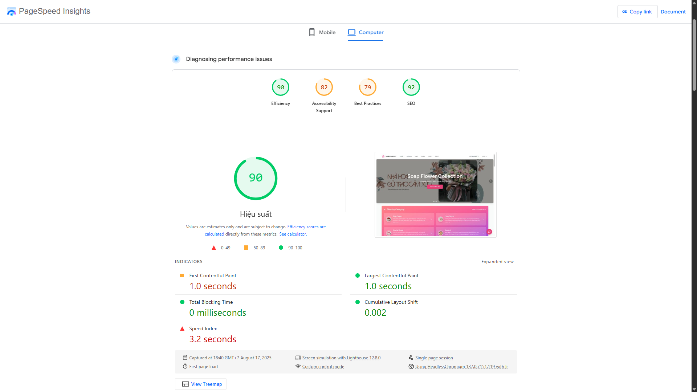

_pagespeed.web.dev_

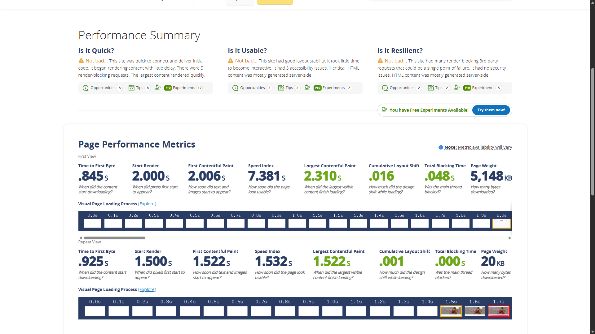

_webpagetest.org_

**_システムパフォーマンス指標_**

</div>

---

## 🗂️ ディレクトリ構成 <a id="structure-jp"></a>

```bash
hanaya-shop/
├── app/                # コントローラー、モデル、サービス
│   ├── Console/        # Artisanコマンド
│   ├── Http/           # コントローラー、ミドルウェア、リクエスト
│   ├── Models/         # モデル
│   ├── Notifications/  # 通知
│   ├── Providers/      # サービスプロバイダー
│   ├── Services/       # サービスクラス
│   └── View/           # Bladeコンポーネント
├── bootstrap/          # Laravel初期化
│   └── cache/          # キャッシュ
├── config/             # システム設定
├── database/           # マイグレーション・シーダー・ファクトリー
│   ├── factories/
│   ├── migrations/
│   ├── seeders/
│   └── sql/
├── deployment/         # 🚀 デプロイメント設定・スクリプト
│   ├── scripts/        # 📜 全デプロイメントスクリプト
│   │   ├── setup-server.sh      # ⚙️ サーバー初期設定
│   │   ├── deploy-production.sh # 🚀 本番デプロイ
│   │   ├── deploy.sh           # 📦 サーバーデプロイ
│   │   ├── update-image.sh     # 🔄 イメージ更新（バックアップ付き）
│   │   ├── update.sh           # ⚡ 高速更新
│   │   ├── auto-backup.sh      # 💾 自動バックアップ
│   │   ├── monitor.sh          # 📊 システム監視
│   │   ├── clear-cache.sh      # 🧹 キャッシュクリア
│   │   ├── verify-deployment.sh # ✅ デプロイ検証
│   │   └── README.md           # 📖 スクリプト説明
│   ├── nginx/          # 🌐 Nginx設定
│   ├── mysql/          # 🗄️ MySQL設定
│   ├── php/            # 🐘 PHP設定
│   ├── supervisor/     # 👷 プロセス管理
│   ├── docker-compose.prod.yml # 🐳 本番Docker設定
│   └── README.md       # 📚 デプロイメントガイド
├── public/             # 画像・エントリポイント
│   ├── build/
│   ├── fixed_resources/
│   ├── images/
│   └── js/
├── resources/          # CSS・JS・Bladeテンプレート・言語
│   ├── css/
│   ├── js/
│   ├── lang/
│   └── views/
├── routes/             # Web/APIルーティング
│   ├── admin.php
│   ├── auth.php
│   ├── console.php
│   ├── user.php
│   └── web.php
├── storage/            # アップロード・ログ
│   ├── framework/
│   └── logs/
├── tests/              # ユニット・機能テスト
│   ├── Feature/
│   └── Unit/
├── .github/            # 🔄 GitHub Actions CI/CD
│   └── workflows/      # ⚙️ 自動化ワークフロー
├── Dockerfile          # Docker設定
├── docker-compose.yml  # Docker環境構築
└── README.md           # ドキュメント
```

## 🚀 今後の改善点 <a id="future-jp"></a>

### I. インフラストラクチャと展開の強化

1. **クラウドインフラのアップグレード**
   - **目的**: AWSまたはAzureサービスを使用してプロジェクトを展開し、スケーラビリティと統合サービスを活用する
   - **現状**: 現在はContaboサービスを使用しており、スケーラビリティが限られている

2. **✅ CI/CDの自動化** ✅
   - **目的**: ソースコード変更時に自動的にデプロイするCI/CDプロセスを強化し、展開時間を短縮
   - **現状**: **完成** - GitHub Actionsを使用した完全自動化パイプラインが導入済み

3. **🔄 セキュリティ強化** 🔄
   - **目的**: SSL証明書を追加し、HTTPSを実装してユーザーセキュリティを向上
   - **現状**: **進行中** - 証明書の基本的な構造は存在するが完全には実装されていない

### II. ユーザーエクスペリエンスの向上

4. **🔄 AI強化型チャットボット** 🔄
   - **目的**: ChatGPT APIを使用してチャットボットを改良し、よりスマートな応答とユーザーの説明から商品を推薦する機能を実現
   - **現状**: **進行中** - 事前定義されたシナリオに基づく基本的なチャットボットが存在

5. **地図APIの統合**
   - **目的**: Maps APIを追加して、顧客と配送スタッフが正確に位置を特定できるようにする
   - **現状**: 地図連携は実装されていない

6. **🔄 インタラクティブ機能** 🔄
   - **目的**: ショート動画、ミニゲーム、クーポンを追加して、買い物中のエンゲージメントを高める
   - **現状**: **進行中** - これらのインタラクティブ機能はまだ実装されていない

7. **注文追跡の強化**
   - **目的**: 注文追跡機能と配送スタッフ向け追跡ページを追加
   - **現状**: 詳細な追跡なしの基本的な注文管理が存在

### III. 管理・運用の改善

8. **管理者向け静的コンテンツ管理**
   - **目的**: fixed-resources内の画像やテキストを管理するための管理ページを追加し、コンテンツ編集を容易にする
   - **現状**: 静的リソースは`public/fixed_resources`に保存されているが、管理インターフェースがない

9. **動的コンテンツの多言語対応**
   - **目的**: データベースに保存されているコンテンツに対する多言語機能を開発
   - **現状**: 現在は静的コンテンツのみが複数言語に対応

10. **商品分類のためのOOP適用**
    - **目的**: 商品タイプをより良く管理するためにOOPでコードアーキテクチャを改善
    - **現状**: 商品モデルの構造は存在するが階層的な実装はされていない

### IV. ビジネスと拡張の改善

11. **実際の決済連携**
    - **目的**: 銀行や電子ウォレットと連携して実際の決済処理を行う
    - **現状**: PaymentServiceの構造は存在するが、実際の決済ゲートウェイとの連携はない

12. **マーケットプレイス展開**
    - **目的**: 単一ショップではなく、複数の出店者を持つEコマースプラットフォームに発展
    - **現状**: 現在は単一店舗モデルとして運営

---

</details>

<details>
<summary><strong>🇺🇸 English</strong></summary>

## Table of Contents

-   [🔗 Links](#links-en)
-   [🛠️ Installation / Setup](#install-en)
-   [Overview](#overview-en)
-   [🎯 Project Goals](#goals-en)
-   [🌟 Features](#features-en)
    -   [👤 For Customers](#customers-en)
    -   [🛠️ For Admins](#admin-en)
-   [🛠️ Technologies Used](#tech-en)
    -   [💡 Highlights & Real-world Impact](#highlights-en)
-   [🗂️ Project Structure](#structure-en)
-   [🚀 Future Improvements](#future-en)

## 🔗 Links <a id="links-en"></a>

<div align="center">
<table><tr>
<td align="center">🌐 <strong><a href="http://hanayashop.com">Hanaya Shop</a></strong></td>
<td align="center">🎬 <strong><a href="https://youtu.be/MLeE64xe4O0">YouTube Demo</a></strong></td>
</tr></table>
</div>

## 🎯 Test Accounts <a id="test-accounts-en"></a>

**Experience Hanaya Shop before registering!** Use one of the following test accounts to explore all customer features completely free without creating a new account.

| Email                      | Password    | Note                              |
|----------------------------|-------------|-----------------------------------|
| testuser0@gmail.com        | 123456789   | Completely free to use            |
| testuser1@gmail.com        | 123456789   | Try all features                  |
| testuser2@gmail.com        | 123456789   | Feel free to explore              |
| testuser3@gmail.com        | 123456789   | Safe to use                       |
| testuser4@gmail.com        | 123456789   | Everything is free                |
| testuser5@gmail.com        | 123456789   | Use freely                        |
| testuser6@gmail.com        | 123456789   | No restrictions                   |
| testuser7@gmail.com        | 123456789   | Casual testing welcome            |
| testuser8@gmail.com        | 123456789   | Full free access                  |
| testuser9@gmail.com        | 123456789   | Free trial account                |

💡 **How to use**: Log in with any of these accounts on the login page and freely explore all customer features such as browsing, purchasing, chatbot, and language switching.

## 🛠️ Installation / Setup <a id="install-en"></a>

-   Production guide: [DEPLOYMENT_GUIDE.md](./%23GUIDE/DEPLOYMENT_GUIDE.md)
-   Development guide: [README_DEV.md](./%23GUIDE/README_DEV.md)

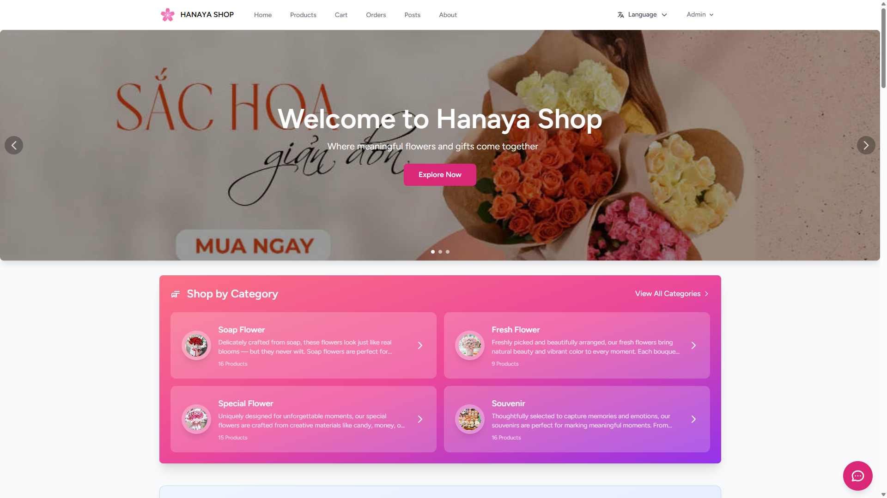
<div align="center">

_Main page visualization_

</div>

## Overview <a id="overview-en"></a>

In Vietnam, especially during holidays, many fresh flowers are wasted because freshness is short and buyers are not reached in time. This mismatch between supply and demand hurts sellers and creates social waste.

**Hanaya Shop** is built to tackle this real problem. It expands exposure for sellers, increases buyer touchpoints, and helps every flower meet the right customer at the right time. With modern, intuitive UX, a reliable Laravel backend, SSR-first rendering, and a pragmatic domain model for inventory, orders, and payments, the platform is production-ready and designed to evolve toward smarter buyer–seller matching and near-zero waste.

<div align="center">


_Real-world image of flower waste problem_

</div>

---

## 🎯 Project Goals <a id="goals-en"></a>

-   Confront the real-world waste problem by improving the match between supply and demand
-   Offer a simple, extensible platform that lowers deployment and operating costs for flower shops
-   Automate inventory, ordering, and payments safely to reduce human error
-   Provide actionable insights via dashboards (revenue, stock, best-sellers) to speed decision-making
-   Keep the architecture open for future integrations (payments, maps, notifications, recommendations)

---

## 🌟 Features <a id="features-en"></a>

### 👤 For Customers <a id="customers-en"></a>

-   Product catalog and details with category/occasion/price filters
-   Best-seller and special-deal highlights
-   Cart, checkout, and order history
-   Multi-language switching (e.g., Japanese/English/Vietnamese)
-   Email notifications for order status updates
-   Chatbot assistance during browsing and checkout
-   Multiple payment options: Cash on Delivery (COD), bank card, PayPal

<div align="center">
<table>
<tr>
<td align="center" width="33%">
<a href=".github/images/en/customer-features.png" target="_blank">
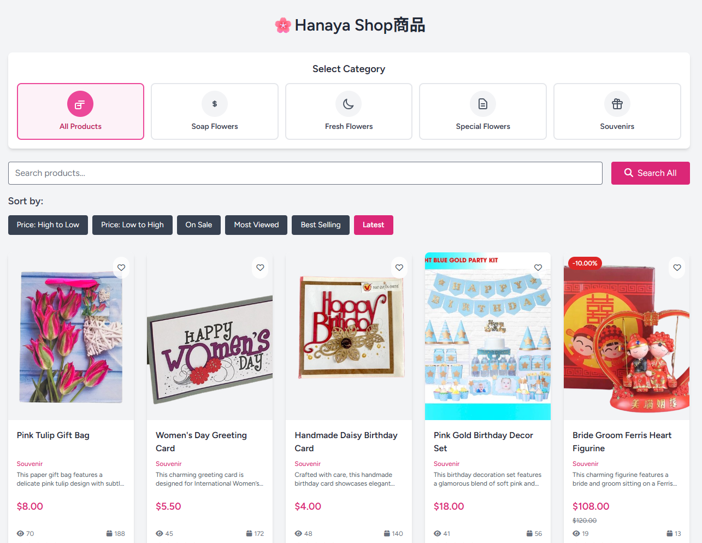
</a>
<br><i>Product catalog & filtering features</i>
</td>
<td align="center" width="33%">
<a href=".github/images/en/customer-features2.png" target="_blank">
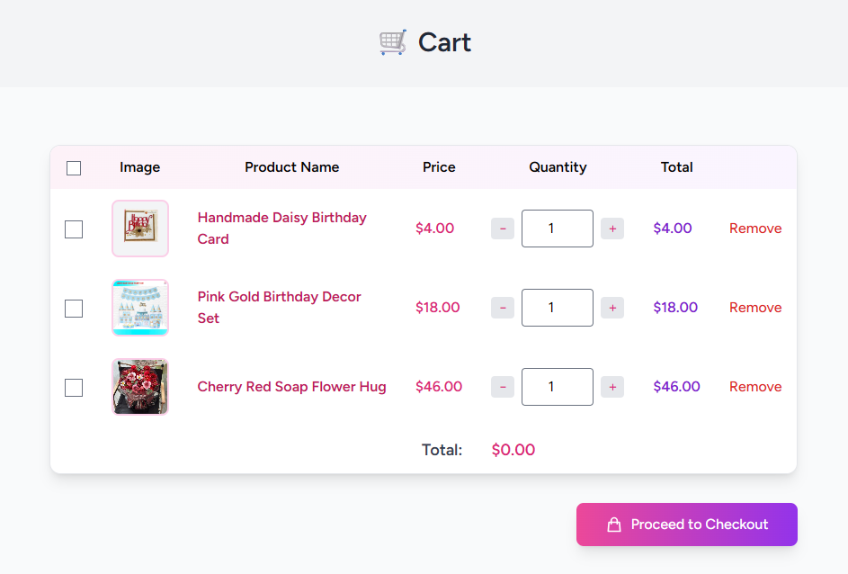
</a>
<br><i>Product details & review system</i>
</td>
<td align="center" width="33%">
<a href=".github/images/en/customer-features3.png" target="_blank">
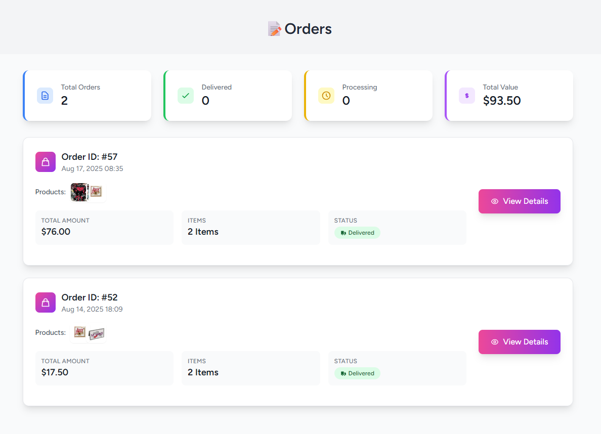
</a>
<br><i>Cart & Checkout</i>
</td>
</tr>
<tr>
<td align="center" width="33%">
<a href=".github/images/en/chat-bot.png" target="_blank">
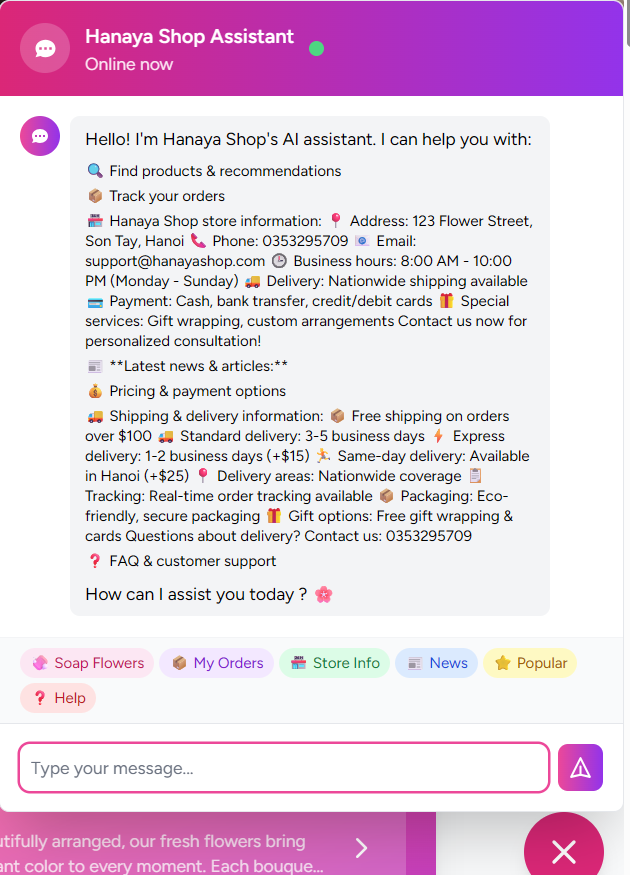
</a>
<br><i>AI Chatbot Support</i>
</td>
<td align="center" width="33%">
<a href=".github/images/en/email.png" target="_blank">
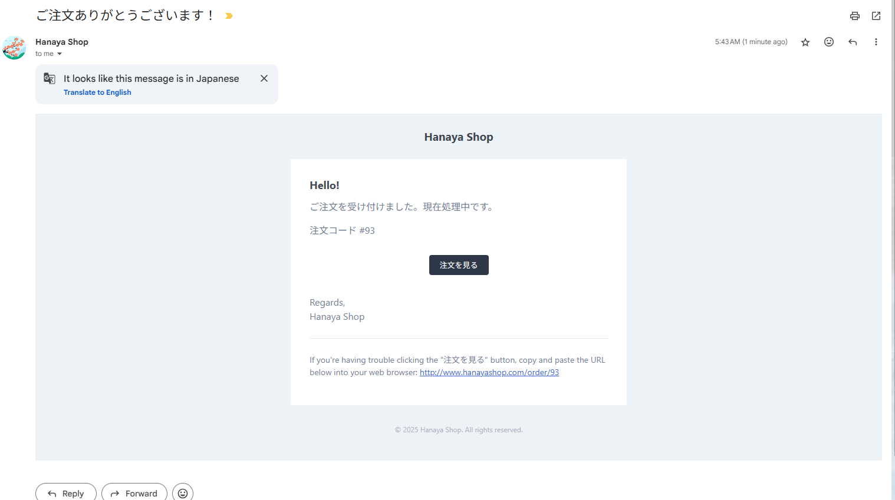
</a>
<br><i>Email Notification System</i>
</td>
<td align="center" width="33%">
<a href=".github/images/en/multi-lang.png" target="_blank">

</a>
<br><i>Multi-language Switching</i>
</td>
</tr>
</table>
</div>

### 🛠️ For Admins <a id="admin-en"></a>

-   Category and product CRUD with visibility toggles
-   Efficient order processing (approve/cancel/update status)
-   Inventory monitoring (low-stock alerts)
-   KPIs and dashboards including monthly revenue tracking
-   Customer management and purchasing insights

<div align="center">
<table>
<tr>
<td align="center" width="50%">
<a href=".github/images/en/admin-dashboard.png" target="_blank">
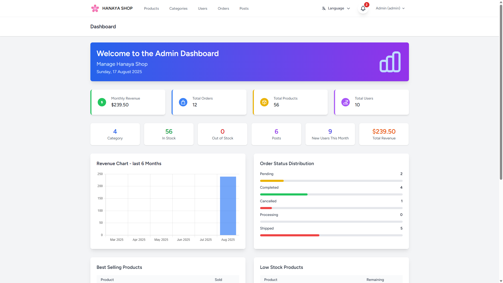
</a>
<br><i>Admin dashboard & analytics</i>
</td>
<td align="center" width="50%">
<a href=".github/images/en/order.png" target="_blank">
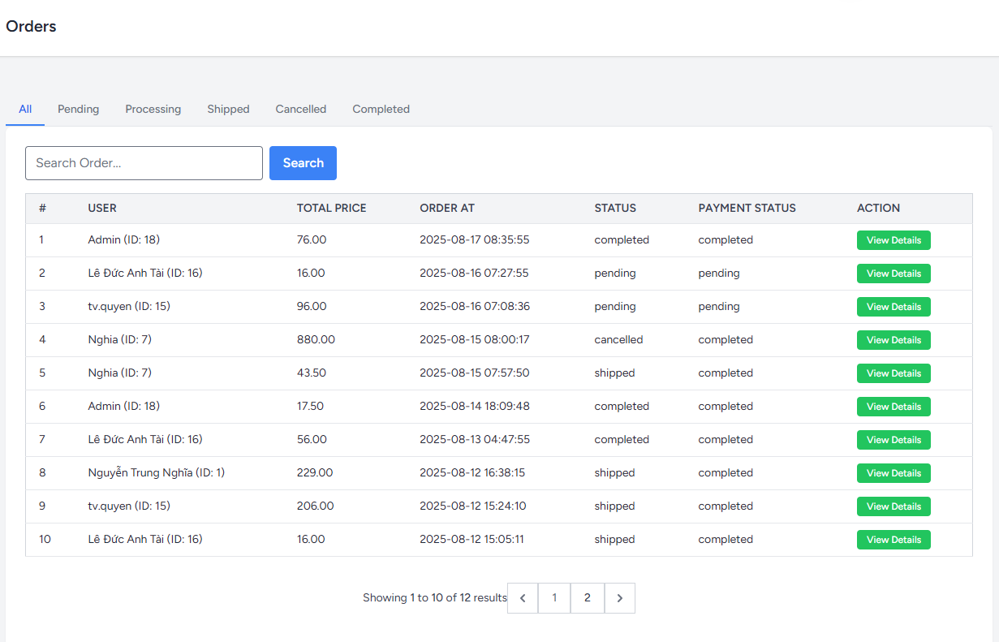
</a>
<br><i>Order management & processing</i>
</td>
</tr>
</table>
</div>

---

## 🛠️ Technologies Used <a id="tech-en"></a>

| Technology     | Purpose                  |
| -------------- | ------------------------ |
| PHP 8.2        | Backend programming      |
| Laravel 12.2   | PHP backend framework    |
| JavaScript     | Frontend programming     |
| Vite           | Fast frontend build tool |
| Blade          | Server-side UI templates |
| Tailwind CSS   | UI design                |
| TinyMCE        | Rich text editor         |
| MySQL          | Database                 |
| Redis          | Cache & queue            |
| nginx          | Web server               |
| Docker Compose | Packaging & deployment   |
| GitHub Actions | CI/CD automation         |

### 💡 Highlights & Real-world Impact <a id="highlights-en"></a>

-   Docker: One-command installs and safe, image-based production updates; eliminates environment drift.
-   SSR + Tailwind: Faster first paint and better SEO; reduces bounce and improves conversion.
-   Queues (Redis): Offloads email and heavy tasks; keeps requests fast and stable.
-   Chatbot: Automates pre-purchase Q&A; reduces cart abandonment.
-   TinyMCE: Better, richer promotional content; improves engagement.
-   Multiple payments (COD, bank card, PayPal): Lowers checkout friction; increases successful payments.
-   **CI/CD with GitHub Actions**: Automated testing, quality checks, and deployment significantly boost development efficiency and code quality.

### 🔄 CI/CD Pipeline (GitHub Actions) <a id="cicd-en"></a>

Established professional development and operations workflow through advanced GitHub Actions automation pipeline:

#### 🧪 **Test Suite (🧪 Test Suite)**
```yaml
📦 Smart Caching: Composer & NPM dependencies optimization
🧪 Comprehensive Testing: Laravel PHPUnit (193 tests + 543 assertions)
🎨 Code Quality: Laravel Pint (automated formatting verification)
🔒 Security Scanning: Composer & NPM vulnerability audits
🐳 Docker Build Testing: Complete production environment simulation
📊 Automated Reports: Test coverage and summary generation
⚡ Parallel execution reduces development feedback to 1-2 minutes
```

#### 🚀 **Production Deploy (🚀 Production Deploy)**
```yaml
🔍 Pre-validation: Full testing in production-level environment
🎯 Staged Testing: unit→feature→integration→performance
🐳 Automated Build: multi-stage Docker with security scanning
📦 Image Management: Tagging, versioning & cache optimization
🛡️ Zero Downtime: Health checks with automated rollback
� Deployment Monitoring: Real-time status reporting
```

#### 💡 **Advanced CI/CD Benefits**
- **🚀 Speed**: Parallel processing & caching reduces time by 50%
- **🎯 Accuracy**: Complete production environment simulation testing
- **🛡️ Security**: Multi-layer defense with automated rollback
- **📊 Visibility**: Real-time status and summary dashboard

#### 📊 Performance Measurement Results

<div align="center">


_pagespeed.web.dev_


_webpagetest.org_

**_System performance metrics_**

</div>

---

## 🗂️ Project Structure <a id="structure-en"></a>

```bash
hanaya-shop/
├── app/                # Controllers, models, services
│   ├── Console/        # Artisan commands
│   ├── Http/           # Controllers, middleware, requests
│   ├── Models/         # Models
│   ├── Notifications/  # Notifications
│   ├── Providers/      # Service providers
│   ├── Services/       # Service classes
│   └── View/           # Blade components
├── bootstrap/          # Laravel initialization
│   └── cache/          # Cache
├── config/             # System configuration
├── database/           # Migrations, seeders, factories
│   ├── factories/
│   ├── migrations/
│   ├── seeders/
│   └── sql/
├── deployment/         # 🚀 Deployment configuration & scripts
│   ├── scripts/        # 📜 All deployment scripts
│   │   ├── setup-server.sh      # ⚙️ Server initial setup
│   │   ├── deploy-production.sh # 🚀 Production deployment
│   │   ├── deploy.sh           # 📦 Server deployment
│   │   ├── update-image.sh     # 🔄 Image update (with backup)
│   │   ├── update.sh           # ⚡ Quick update
│   │   ├── auto-backup.sh      # 💾 Automated backup
│   │   ├── monitor.sh          # 📊 System monitoring
│   │   ├── clear-cache.sh      # 🧹 Cache clearing
│   │   ├── verify-deployment.sh # ✅ Deployment verification
│   │   └── README.md           # 📖 Scripts documentation
│   ├── nginx/          # 🌐 Nginx configuration
│   ├── mysql/          # 🗄️ MySQL configuration
│   ├── php/            # 🐘 PHP configuration
│   ├── supervisor/     # 👷 Process management
│   ├── docker-compose.prod.yml # 🐳 Production Docker setup
│   └── README.md       # 📚 Deployment guide
├── public/             # Images & entry point
│   ├── build/
│   ├── fixed_resources/
│   ├── images/
│   └── js/
├── resources/          # CSS, JS, Blade templates, languages
│   ├── css/
│   ├── js/
│   ├── lang/
│   └── views/
├── routes/             # Web/API routing
│   ├── admin.php
│   ├── auth.php
│   ├── console.php
│   ├── user.php
│   └── web.php
├── storage/            # Uploads, logs
│   ├── framework/
│   └── logs/
├── tests/              # Unit & feature tests
│   ├── Feature/
│   └── Unit/
├── .github/            # 🔄 GitHub Actions CI/CD
│   └── workflows/      # ⚙️ Automation workflows
├── Dockerfile          # Docker configuration
├── docker-compose.yml  # Docker setup
└── README.md           # Documentation
```

## 🚀 Future Improvements <a id="future-en"></a>

### I. Infrastructure & Deployment Enhancements

1. **Cloud Infrastructure Upgrade**
   - **Purpose**: Utilize AWS or Azure services for project deployment, leveraging scalability and integrated services
   - **Current Status**: Currently using Contabo services with limited scalability options

2. **✅ Automated CI/CD** ✅
   - **Purpose**: Enhance CI/CD process to automate deployment when source code changes, reducing deployment time
   - **Current Status**: **Completed** - Full automation pipeline implemented using GitHub Actions

3. **🔄 Enhanced Security** 🔄
   - **Purpose**: Add SSL certificates and implement HTTPS for increased user security
   - **Current Status**: **In Progress** - Basic structure for certificates exists but not fully implemented

### II. User Experience Improvements

4. **🔄 AI-Enhanced Chatbot** 🔄
   - **Purpose**: Improve the chatbot using ChatGPT API for smarter responses and product recommendations from user descriptions
   - **Current Status**: **In Progress** - A basic chatbot exists that works on predefined scenarios

5. **Maps Integration**
   - **Purpose**: Add Maps API to help customers and delivery personnel accurately locate addresses
   - **Current Status**: No map integration implemented

6. **🔄 Interactive Features** 🔄
   - **Purpose**: Add short videos, mini-games, and vouchers to increase engagement during shopping
   - **Current Status**: **In Progress** - These interactive features are not yet implemented

7. **Order Tracking Enhancement**
   - **Purpose**: Add order tracking functionality and a tracking page for delivery personnel
   - **Current Status**: Basic order management exists without detailed tracking

### III. Management & Operational Improvements

8. **Admin Static Content Management**
   - **Purpose**: Add a management page for Images and Text in fixed-resources to facilitate content editing
   - **Current Status**: Static resources are stored in `public/fixed_resources` but lack a management interface

9. **Multi-language for Dynamic Content**
   - **Purpose**: Develop multi-language capability for database-stored content
   - **Current Status**: Currently only static content supports multiple languages

10. **OOP for Product Classification**
    - **Purpose**: Improve code architecture with OOP to better manage product types
    - **Current Status**: Product model structure exists but without full hierarchical implementation

### IV. Business & Expansion Improvements

11. **Real Payment Integration**
    - **Purpose**: Integrate with banks and e-wallets for actual payment processing
    - **Current Status**: PaymentService structure exists but without real payment gateway integration

12. **Marketplace Expansion**
    - **Purpose**: Evolve into an e-commerce platform with multiple sellers instead of a single shop
    - **Current Status**: Currently operating as a single store model

---

</details>

<details>
<summary><strong>🇻🇳 Tiếng Việt</strong></summary>

## Mục lục

-   [🔗 Đường dẫn](#links-vi)
-   [🛠️ Hướng dẫn cài đặt / thiết lập](#install-vi)
-   [Giới thiệu](#overview-vi)
-   [🎯 Mục tiêu dự án](#goals-vi)
-   [🌟 Tính năng](#features-vi)
    -   [👤 Trang người dùng](#customers-vi)
    -   [🛠️ Trang quản trị](#admin-vi)
-   [🛠️ Công nghệ sử dụng](#tech-vi)
    -   [💡 Điểm nổi bật & Hiệu quả thực tế](#highlights-vi)
-   [🗂️ Cấu trúc dự án](#structure-vi)
-   [🚀 Cải tiến trong tương lai](#future-vi)

## 🔗 Đường dẫn <a id="links-vi"></a>

<div align="center">
<table><tr>
<td align="center">🌐 <strong><a href="http://hanayashop.com">Hanaya Shop</a></strong></td>
<td align="center">🎬 <strong><a href="https://youtu.be/MLeE64xe4O0">YouTube Demo</a></strong></td>
</tr></table>
</div>

## 🎯 Tài khoản test <a id="test-accounts-vi"></a>

**Trải nghiệm Hanaya Shop trước khi đăng ký!** Sử dụng một trong những tài khoản test dưới đây để khám phá toàn bộ chức năng dành cho khách hàng hoàn toàn miễn phí mà không cần tạo tài khoản mới.

| Email                      | Mật khẩu    | Ghi chú                           |
|----------------------------|-------------|-----------------------------------|
| testuser0@gmail.com        | 123456789   | Hoàn toàn miễn phí sử dụng        |
| testuser1@gmail.com        | 123456789   | Thử tất cả tính năng              |
| testuser2@gmail.com        | 123456789   | Cứ thoải mái khám phá             |
| testuser3@gmail.com        | 123456789   | An toàn khi sử dụng               |
| testuser4@gmail.com        | 123456789   | Mọi thứ đều miễn phí              |
| testuser5@gmail.com        | 123456789   | Sử dụng tự do                     |
| testuser6@gmail.com        | 123456789   | Không có hạn chế                  |
| testuser7@gmail.com        | 123456789   | Thử nghiệm thoải mái              |
| testuser8@gmail.com        | 123456789   | Truy cập miễn phí đầy đủ          |
| testuser9@gmail.com        | 123456789   | Tài khoản thử nghiệm miễn phí     |

💡 **Cách sử dụng**: Đăng nhập bằng bất kỳ tài khoản nào trong số này trên trang đăng nhập và tự do khám phá các chức năng khách hàng như xem sản phẩm, mua hàng, chatbot, đổi ngôn ngữ.

## 🛠️ Hướng dẫn cài đặt / thiết lập <a id="install-vi"></a>

-   Production: [DEPLOYMENT_GUIDE.md](./%23GUIDE/DEPLOYMENT_GUIDE.md)
-   Developing: [README_DEV.md](./%23GUIDE/README_DEV.md)

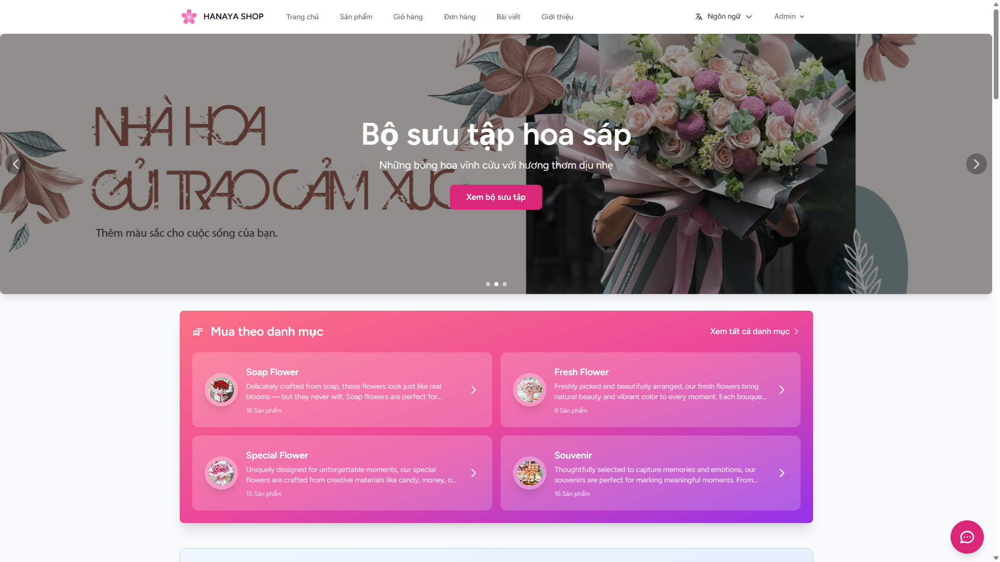
<div align="center">

_Hình ảnh trang chủ_

</div>

## Giới thiệu <a id="overview-vi"></a>

Ở Việt Nam, đặc biệt vào các dịp lễ Tết, rất nhiều bông hoa bị bỏ đi do thời gian tươi ngắn và người bán không kịp tiếp cận đúng khách hàng. Sự lệch pha giữa cung và cầu gây lãng phí xã hội và thiệt hại cho người bán.

**Hanaya Shop** được xây dựng để giải quyết vấn đề thực tế đó. Nền tảng giúp mở rộng mức độ hiển thị của cửa hàng, tăng điểm chạm với khách hàng, và đưa mỗi bông hoa đến đúng người, đúng thời điểm. Ứng dụng có UI/UX hiện đại, backend Laravel tin cậy, SSR nhanh, và mô hình nghiệp vụ thực tế cho tồn kho, đơn hàng, thanh toán. Tầm nhìn dài hạn là tăng cường kết nối người bán–người mua, tiến tới giảm thiểu hoa bị lãng phí đến mức thấp nhất.

<div align="center">


_Hình ảnh thực tế cho vấn đề hoa bị lãng phí_

</div>

---

## 🎯 Mục tiêu dự án <a id="goals-vi"></a>

-   Trực diện bài toán lãng phí bằng cách tối ưu kết nối cung–cầu và tăng chuyển đổi
-   Cung cấp nền tảng đơn giản, dễ mở rộng, giảm chi phí triển khai/vận hành cho cửa hàng
-   Tự động hóa an toàn các quy trình tồn kho, đặt hàng, thanh toán để giảm sai sót
-   Cung cấp dashboard số liệu (doanh thu, tồn kho, bán chạy) hỗ trợ quyết định nhanh
-   Mở đường cho tích hợp tương lai (thanh toán, bản đồ, thông báo, gợi ý sản phẩm)

---

## 🌟 Tính năng <a id="features-vi"></a>

### 👤 Trang người dùng <a id="customers-vi"></a>

-   Danh mục/chi tiết sản phẩm, lọc theo loại/dịp/giá
-   Nổi bật Best Seller, ưu đãi giảm giá mạnh
-   Giỏ hàng, đặt hàng, lịch sử mua
-   Đổi ngôn ngữ (Nhật/Anh/Việt)
-   Thông báo qua email theo trạng thái đơn hàng
-   Chatbot hỗ trợ tư vấn
-   Thanh toán đa dạng: Thanh toán khi nhận hàng (COD), thẻ ngân hàng, PayPal

<div align="center">
<table>
<tr>
<td align="center" width="33%">
<a href=".github/images/vi/customer-features.png" target="_blank">
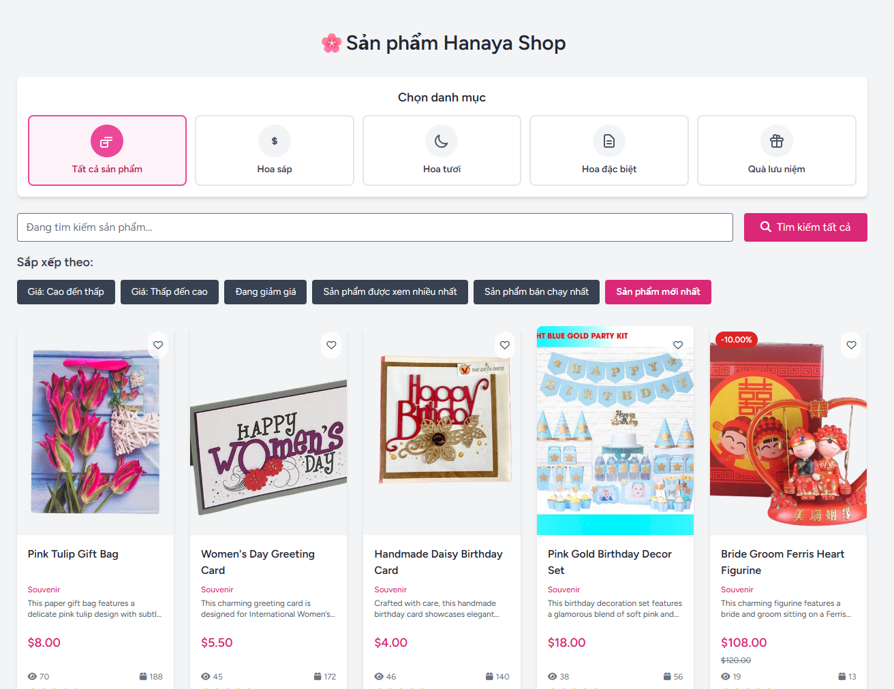
</a>
<br><i>Danh mục sản phẩm & tính năng lọc</i>
</td>
<td align="center" width="33%">
<a href=".github/images/vi/customer-features2.png" target="_blank">
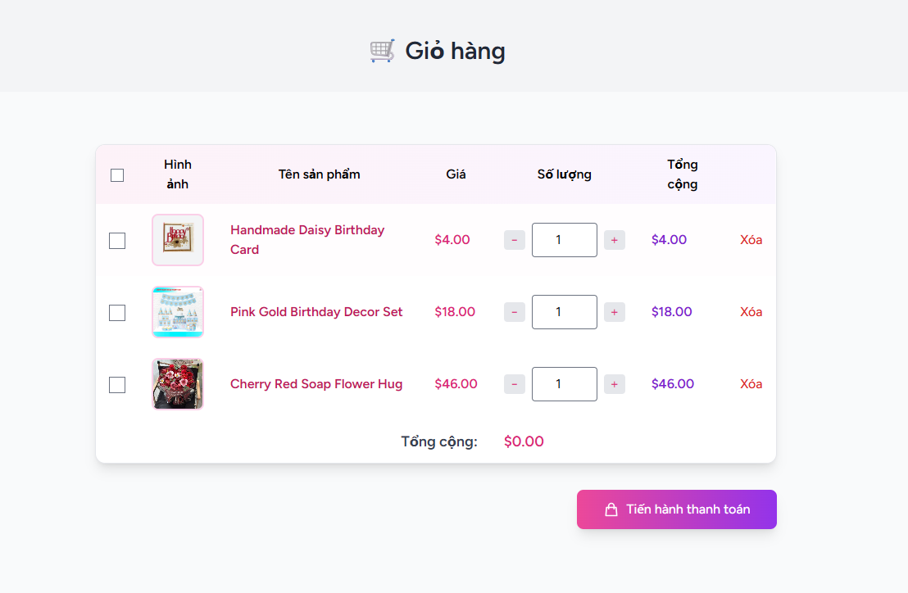
</a>
<br><i>Chi tiết sản phẩm & hệ thống đánh giá</i>
</td>
<td align="center" width="33%">
<a href=".github/images/vi/customer-features3.png" target="_blank">
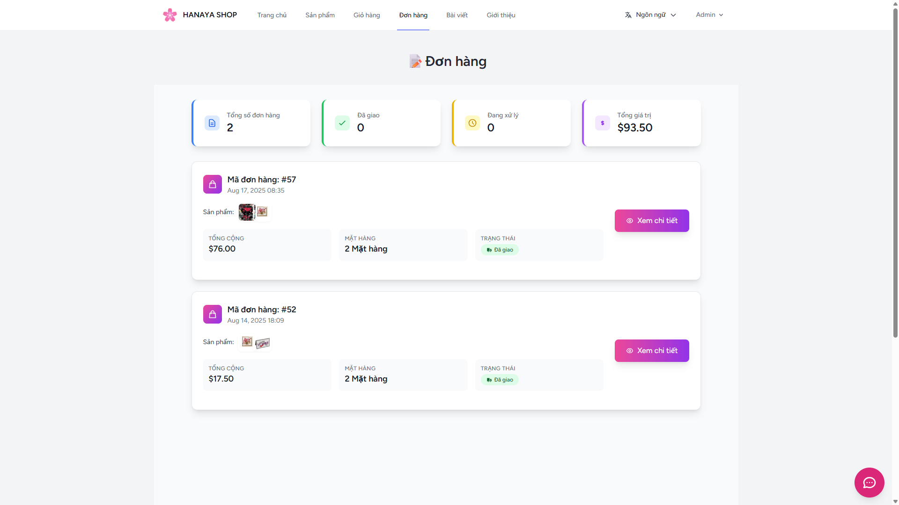
</a>
<br><i>Giỏ hàng & Thanh toán</i>
</td>
</tr>
<tr>
<td align="center" width="33%">
<a href=".github/images/vi/chat-bot.png" target="_blank">

</a>
<br><i>Hỗ trợ Chatbot AI</i>
</td>
<td align="center" width="33%">
<a href=".github/images/vi/email.png" target="_blank">

</a>
<br><i>Hệ thống thông báo qua email</i>
</td>
<td align="center" width="33%">
<a href=".github/images/vi/multi-lang.png" target="_blank">

</a>
<br><i>Chuyển đổi ngôn ngữ</i>
</td>
</tr>
</table>
</div>

### 🛠️ Trang quản trị <a id="admin-vi"></a>

-   Quản lý danh mục, sản phẩm (CRUD, bật/tắt hiển thị)
-   Xử lý đơn hàng tiện lợi (duyệt/huỷ/cập nhật trạng thái)
-   Theo dõi tồn kho (cảnh báo sắp hết hàng)
-   Thống kê/KPI, theo dõi doanh thu hàng tháng
-   Quản lý khách hàng, phân tích hành vi mua

<div align="center">
<table>
<tr>
<td align="center" width="50%">
<a href=".github/images/vi/admin-dashboard.png" target="_blank">
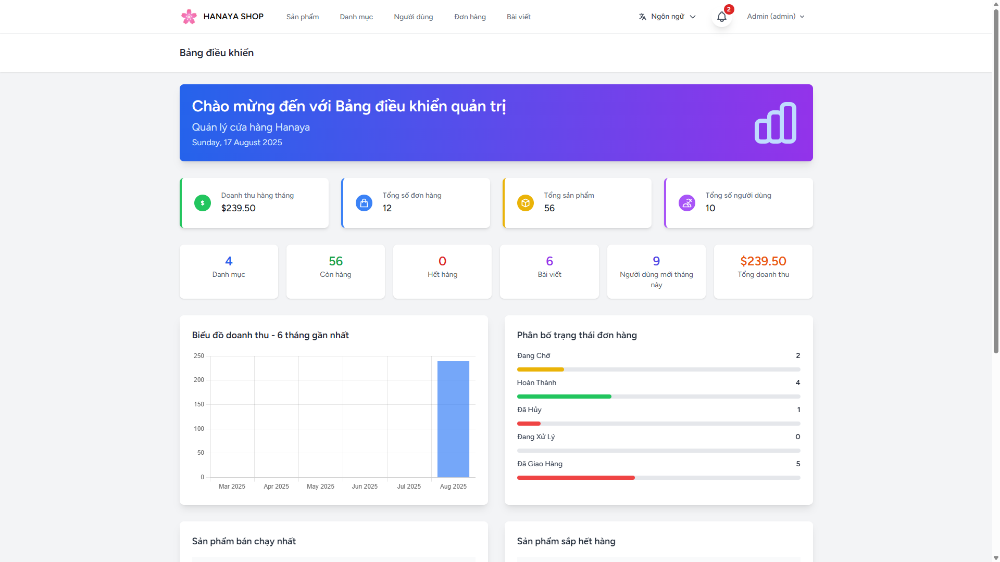
</a>
<br><i>Dashboard quản trị & thống kê</i>
</td>
<td align="center" width="50%">
<a href=".github/images/vi/order.png" target="_blank">
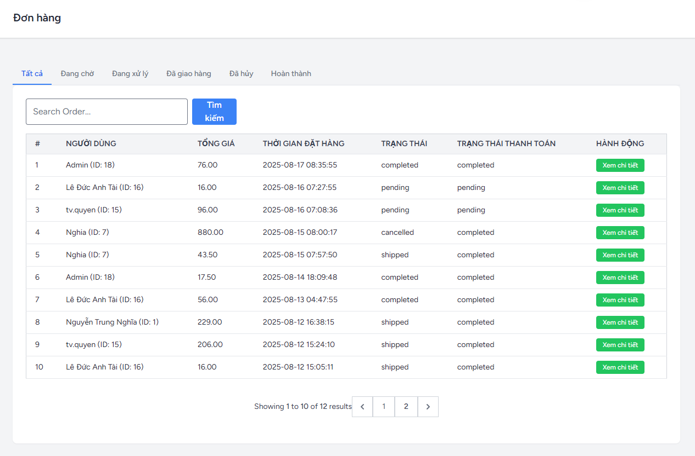
</a>
<br><i>Quản lý & xử lý đơn hàng</i>
</td>
</tr>
</table>
</div>

---

## 🛠️ Công nghệ sử dụng <a id="tech-vi"></a>

| Công nghệ      | Mục đích sử dụng           |
| -------------- | -------------------------- |
| PHP 8.2        | Lập trình backend          |
| Laravel 12.2   | Framework backend PHP      |
| JavaScript     | Lập trình frontend         |
| Vite           | Build frontend nhanh       |
| Blade          | Giao diện phía server      |
| Tailwind CSS   | Thiết kế giao diện         |
| TinyMCE        | Soạn thảo văn bản nâng cao |
| MySQL          | Cơ sở dữ liệu              |
| Redis          | Cache & queue              |
| nginx          | Web server                 |
| Docker         | Đóng gói & triển khai      |

### 💡 Điểm nổi bật & Hiệu quả thực tế <a id="highlights-vi"></a>

-   Docker: Cài đặt 1 lệnh, cập nhật an toàn bằng cách thay image; loại bỏ sai lệch môi trường.
-   SSR + Tailwind: Hiển thị đầu nhanh, tốt cho SEO; giảm bounce và tăng chuyển đổi.
-   Hàng đợi (Redis): Đẩy email và tác vụ nặng sang nền; giữ request nhanh và ổn định.
-   Chatbot: Tự động giải đáp trước khi mua; giảm tỷ lệ bỏ giỏ hàng.
-   TinyMCE: Nội dung tiếp thị giàu hình ảnh; tăng tương tác.
-   Thanh toán đa dạng (COD, thẻ ngân hàng, PayPal): Giảm ma sát khi checkout; tăng tỉ lệ thanh toán thành công.
-   **CI/CD với GitHub Actions**: Tự động hóa kiểm thử, kiểm tra chất lượng và triển khai, nâng cao đáng kể hiệu quả phát triển và chất lượng code.

### 🔄 Quy trình CI/CD (GitHub Actions) <a id="cicd-vi"></a>

Thiết lập quy trình phát triển và vận hành chuyên nghiệp thông qua pipeline tự động hóa GitHub Actions tiên tiến:

#### 🧪 **Bộ kiểm thử (🧪 Test Suite)**
```yaml
📦 Smart Caching: Tối ưu hóa dependencies Composer & NPM
🧪 Kiểm thử toàn diện: Laravel PHPUnit (193 tests + 543 assertions)
🎨 Chất lượng code: Laravel Pint (xác minh format tự động)
🔒 Quét bảo mật: Kiểm tra lỗ hổng Composer & NPM
🐳 Test Docker Build: Mô phỏng hoàn chỉnh môi trường production
📊 Báo cáo tự động: Tạo coverage và tóm tắt test
⚡ Thực thi song song giảm thời gian phản hồi xuống 1-2 phút
```

#### 🚀 **Triển khai Production (🚀 Production Deploy)**
```yaml
🔍 Xác thực trước: Kiểm thử đầy đủ trong môi trường production-level
🎯 Kiểm thử phân tầng: unit→feature→integration→performance
🐳 Build tự động: multi-stage Docker với quét bảo mật
📦 Quản lý Image: Tagging, versioning & tối ưu cache
🛡️ Zero Downtime: Health checks với rollback tự động
📊 Giám sát triển khai: Báo cáo trạng thái real-time
```

#### 💡 **Lợi ích CI/CD tiên tiến**
- **🚀 Tốc độ**: Xử lý song song & cache giảm 50% thời gian
- **🎯 Độ chính xác**: Kiểm thử mô phỏng hoàn chỉnh môi trường production
- **🛡️ Bảo mật**: Phòng thủ đa tầng với rollback tự động
- **📊 Khả năng quan sát**: Dashboard trạng thái và tóm tắt real-time

### 📊 Kết quả đo hiệu suất

<div align="center">


_pagespeed.web.dev_


_webpagetest.org_

**_Chỉ số hiệu suất hệ thống_**

</div>

---

## 🗂️ Cấu trúc dự án <a id="structure-vi"></a>

```bash
hanaya-shop/
├── #GUIDE/            # 📆 Hướng dẫn triển khai & phát triển
├── app/                # Controller, model, service
│   ├── Console/        # Artisan command
│   ├── Http/           # Controller, middleware, request
│   ├── Models/         # Model
│   ├── Notifications/  # Notification
│   ├── Providers/      # Service provider
│   ├── Services/       # Service class
│   └── View/           # Blade component
├── bootstrap/          # Khởi tạo Laravel
│   └── cache/          # Cache
├── config/             # Cấu hình hệ thống
├── database/           # Migration, seeder, factory
│   ├── factories/
│   ├── migrations/
│   ├── seeders/
│   └── sql/
├── deployment/         # 🚀 Cấu hình & script triển khai
│   ├── nginx/          # 🌐 Cấu hình Nginx
│   ├── mysql/          # 🗄️ Cấu hình MySQL
│   ├── php/            # 🐘 Cấu hình PHP
│   ├── supervisor/     # 👷 Quản lý tiến trình
│   └── docker-compose.prod.yml # 🐳 Thiết lập Docker production
├── docker/             # 🐳 Các file cấu hình Docker
├── public/             # Hình ảnh, entry point
│   ├── build/
│   ├── fixed_resources/
│   ├── images/
│   └── js/
├── resources/          # CSS, JS, Blade template, ngôn ngữ
│   ├── css/
│   ├── js/
│   ├── lang/
│   └── views/
├── routes/             # Tuyến web/API
│   ├── admin.php
│   ├── auth.php
│   ├── console.php
│   ├── user.php
│   └── web.php
├── storage/            # Upload, log
│   ├── framework/
│   └── logs/
├── tests/              # Unit test & feature test
│   ├── Feature/
│   └── Unit/
├── .github/            # 🔄 GitHub Actions CI/CD
│   └── workflows/      # ⚙️ Quy trình tự động hóa
├── Dockerfile          # Cấu hình Docker
├── docker-compose.yml  # Thiết lập Docker
└── README.md           # Tài liệu dự án
```

## 🚀 Cải tiến trong tương lai <a id="future-vi"></a>

### I. Cải tiến hạ tầng và triển khai

1. **Nâng cấp hạ tầng đám mây**
   - **Mục đích**: Sử dụng dịch vụ của AWS hoặc Azure để triển khai dự án, tận dụng khả năng mở rộng và các dịch vụ tích hợp
   - **Hiện trạng**: Hiện đang sử dụng dịch vụ của Contabo với hạn chế về khả năng mở rộng

2. **✅ CI/CD tự động hóa** ✅
   - **Mục đích**: Cải tiến quy trình CI/CD để tự động hóa khi có thay đổi mã nguồn, giúp giảm thời gian triển khai
   - **Hiện trạng**: **Hoàn thành** - Đã triển khai pipeline tự động hóa hoàn chỉnh sử dụng GitHub Actions

3. **🔄 Bảo mật nâng cao** 🔄
   - **Mục đích**: Thêm chứng chỉ SSL và áp dụng HTTPS để tăng tính bảo mật cho người dùng
   - **Hiện trạng**: **Đang tiến hành** - Đã có cấu trúc cơ bản cho chứng chỉ nhưng chưa triển khai đầy đủ

### II. Cải tiến trải nghiệm người dùng

4. **🔄 Nâng cao Chatbot với AI** 🔄
   - **Mục đích**: Cải tiến Chatbot sử dụng API của ChatGPT để trả lời thông minh hơn, có khả năng đề xuất sản phẩm từ mô tả của người dùng
   - **Hiện trạng**: **Đang tiến hành** - Đã có chatbot đơn giản hoạt động dựa trên kịch bản cố định

5. **Tích hợp bản đồ**
   - **Mục đích**: Thêm API Maps giúp khách hàng và người giao dễ dàng xác định vị trí chính xác
   - **Hiện trạng**: Chưa triển khai tích hợp bản đồ

6. **🔄 Tăng tính tương tác** 🔄
   - **Mục đích**: Thêm short video, mini game, voucher để tăng sự hứng thú khi mua hàng
   - **Hiện trạng**: **Đang tiến hành** - Chưa triển khai các tính năng tương tác này
 cao đáng kể hiệu quả phát triển và chất lượng code.

### 🔄 Quy trình CI/CD (GitHub Actions) <a id="cicd-vi"></a>

Thiết lập quy trình phát triển và vận hành chuyên nghiệp thông qua pipeline tự động hóa GitHub Actions tiên tiến:

#### 🧪 **Bộ kiểm thử (🧪 Test Suite)**
```yaml
📦 Smart Caching: Tối ưu hóa dependencies Composer & NPM
🧪 Kiểm thử toàn diện: Laravel PHPUnit (193 tests + 543 assertions)
🎨 Chất lượng code: Laravel Pint (xác minh format tự động)
🔒 Quét bảo mật: Kiểm tra lỗ hổng Composer & NPM
🐳 Test Docker Build: Mô phỏng hoàn chỉnh môi trường production
📊 Báo cáo tự động: Tạo coverage và tóm tắt test
⚡ Thực thi song song giảm thời gian phản hồi xuống 1-2 phút
```

#### 🚀 **Triển khai Production (🚀 Production Deploy)**
```yaml
🔍 Xác thực trước: Kiểm thử đầy đủ trong môi trường production-level
🎯 Kiểm thử phân tầng: unit→feature→integration→performance
🐳 Build tự động: multi-stage Docker với quét bảo mật
📦 Quản lý Image: Tagging, versioning & tối ưu cache
🛡️ Zero Downtime: Health checks với rollback tự động
📊 Giám sát triển khai: Báo cáo trạng thái real-time
```

#### 💡 **Lợi ích CI/CD tiên tiến**
- **🚀 Tốc độ**: Xử lý song song & cache giảm 50% thời gian
- **🎯 Độ chính xác**: Kiểm thử mô phỏng hoàn chỉnh môi trường production
- **🛡️ Bảo mật**: Phòng thủ đa tầng với rollback tự động
- **📊 Khả năng quan sát**: Dashboard trạng thái và tóm tắt real-time

### 📊 Kết quả đo hiệu suất

<div align="center">


_pagespeed.web.dev_


_webpagetest.org_

**_Chỉ số hiệu suất hệ thống_**

</div>

---

## 🗂️ Cấu trúc dự án <a id="structure-vi"></a>

```bash
hanaya-shop/
├── #GUIDE/            # 📆 Hướng dẫn triển khai & phát triển
├── app/                # Controller, model, service
│   ├── Console/        # Artisan command
│   ├── Http/           # Controller, middleware, request
│   ├── Models/         # Model
│   ├── Notifications/  # Notification
│   ├── Providers/      # Service provider
│   ├── Services/       # Service class
│   └── View/           # Blade component
├── bootstrap/          # Khởi tạo Laravel
│   └── cache/          # Cache
├── config/             # Cấu hình hệ thống
├── database/           # Migration, seeder, factory
│   ├── factories/
│   ├── migrations/
│   ├── seeders/
│   └── sql/
├── deployment/         # 🚀 Cấu hình & script triển khai
│   ├── nginx/          # 🌐 Cấu hình Nginx
│   ├── mysql/          # 🗄️ Cấu hình MySQL
│   ├── php/            # 🐘 Cấu hình PHP
│   ├── supervisor/     # 👷 Quản lý tiến trình
│   └── docker-compose.prod.yml # 🐳 Thiết lập Docker production
├── docker/             # 🐳 Các file cấu hình Docker
├── public/             # Hình ảnh, entry point
│   ├── build/
│   ├── fixed_resources/
│   ├── images/
│   └── js/
├── resources/          # CSS, JS, Blade template, ngôn ngữ
│   ├── css/
│   ├── js/
│   ├── lang/
│   └── views/
├── routes/             # Tuyến web/API
│   ├── admin.php
│   ├── auth.php
│   ├── console.php
│   ├── user.php
│   └── web.php
├── storage/            # Upload, log
│   ├── framework/
│   └── logs/
├── tests/              # Unit test & feature test
│   ├── Feature/
│   └── Unit/
├── .github/            # 🔄 GitHub Actions CI/CD
│   └── workflows/      # ⚙️ Quy trình tự động hóa
├── Dockerfile          # Cấu hình Docker
├── docker-compose.yml  # Thiết lập Docker
└── README.md           # Tài liệu dự án
```

## 🚀 Cải tiến trong tương lai <a id="future-vi"></a>

### I. Cải tiến hạ tầng và triển khai

1. **Nâng cấp hạ tầng đám mây**
   - **Mục đích**: Sử dụng dịch vụ của AWS hoặc Azure để triển khai dự án, tận dụng khả năng mở rộng và các dịch vụ tích hợp
   - **Hiện trạng**: Hiện đang sử dụng dịch vụ của Contabo với hạn chế về khả năng mở rộng

2. **✅ CI/CD tự động hóa** ✅
   - **Mục đích**: Cải tiến quy trình CI/CD để tự động hóa khi có thay đổi mã nguồn, giúp giảm thời gian triển khai
   - **Hiện trạng**: **Hoàn thành** - Đã triển khai pipeline tự động hóa hoàn chỉnh sử dụng GitHub Actions

3. **🔄 Bảo mật nâng cao** 🔄
   - **Mục đích**: Thêm chứng chỉ SSL và áp dụng HTTPS để tăng tính bảo mật cho người dùng
   - **Hiện trạng**: **Đang tiến hành** - Đã có cấu trúc cơ bản cho chứng chỉ nhưng chưa triển khai đầy đủ

### II. Cải tiến trải nghiệm người dùng

4. **🔄 Nâng cao Chatbot với AI** 🔄
   - **Mục đích**: Cải tiến Chatbot sử dụng API của ChatGPT để trả lời thông minh hơn, có khả năng đề xuất sản phẩm từ mô tả của người dùng
   - **Hiện trạng**: **Đang tiến hành** - Đã có chatbot đơn giản hoạt động dựa trên kịch bản cố định

5. **Tích hợp bản đồ**
   - **Mục đích**: Thêm API Maps giúp khách hàng và người giao dễ dàng xác định vị trí chính xác
   - **Hiện trạng**: Chưa triển khai tích hợp bản đồ

6. **🔄 Tăng tính tương tác** 🔄
   - **Mục đích**: Thêm short video, mini game, voucher để tăng sự hứng thú khi mua hàng
   - **Hiện trạng**: **Đang tiến hành** - Chưa triển khai các tính năng tương tác này

7. **Cải tiến theo dõi đơn hàng**
   - **Mục đích**: Thêm chức năng theo dõi đơn hàng và trang theo dõi cho người giao hàng
   - **Hiện trạng**: Có quản lý đơn hàng cơ bản nhưng chưa có tracking chi tiết

### III. Cải tiến quản lý và vận hành

8. **Quản lý nội dung tĩnh cho admin**
   - **Mục đích**: Thêm trang quản lý Ảnh, Text trong fixed-resources bên Admin để dễ sửa đổi nội dung
   - **Hiện trạng**: Các tài nguyên tĩnh đã được lưu trong `public/fixed_resources` nhưng chưa có giao diện quản lý

9. **Đa ngôn ngữ cho dữ liệu động**
   - **Mục đích**: Phát triển khả năng đa ngôn ngữ cho cả nội dung được lưu trong cơ sở dữ liệu
   - **Hiện trạng**: Hiện chỉ hỗ trợ đa ngôn ngữ cho nội dung tĩnh

10. **Áp dụng OOP cho phân loại sản phẩm**
    - **Mục đích**: Cải tiến kiến trúc code theo hướng OOP để quản lý tốt hơn các loại mặt hàng
    - **Hiện trạng**: Đã có cấu trúc model sản phẩm nhưng chưa phân cấp đầy đủ

### IV. Cải tiến kinh doanh và mở rộng

11. **Tích hợp thanh toán thực tế**
    - **Mục đích**: Liên kết với ngân hàng, ví điện tử để có hệ thống thanh toán thực tế
    - **Hiện trạng**: Đã có PaymentService nhưng chưa tích hợp với dịch vụ thanh toán thật

12. **Mở rộng thành marketplace**
    - **Mục đích**: Phát triển thành sàn thương mại điện tử với nhiều người bán thay vì một cửa hàng đơn lẻ
    - **Hiện trạng**: Hiện đang vận hành theo mô hình cửa hàng đơn

---

</details>


<div align="center">

   <h2>✨ Authors ✨</h2>

   <table>
      <tr>
         <td align="center">
            
            <br/>
            <b style="font-size:1.18em;">Nguyen Trung Nghia</b><br/>
            <a href="https://nguyentrungnghia1802.github.io/Portfolio/" style="display:inline-block;padding:7px 20px;margin:7px 0;font-size:1.08em;font-weight:500;background:#f7f7f7;border-radius:7px;border:1.5px solid #e0e0e0;text-decoration:none;color:#222;box-shadow:0 1.5px 6px #0001;transition:background 0.2s;">
              <span style="font-size:1.1em;vertical-align:middle;">👤</span> Profile
            </a>
         </td>
         <td align="center">
            
            <br/>
            <b style="font-size:1.18em;">Le Duc Anh Tai</b><br/>
            <a href="https://github.com/leducanhtai" style="display:inline-block;padding:7px 20px;margin:7px 0;font-size:1.08em;font-weight:500;background:#f7f7f7;border-radius:7px;border:1.5px solid #e0e0e0;text-decoration:none;color:#222;box-shadow:0 1.5px 6px #0001;transition:background 0.2s;">
              <span style="font-size:1.1em;vertical-align:middle;">👤</span> Profile
            </a>
         </td>
         <td align="center">
            
            <br/>
            <b style="font-size:1.18em;">Tan Van Quyen</b><br/>
            <a href="https://github.com/Nezuko1909" style="display:inline-block;padding:7px 20px;margin:7px 0;font-size:1.08em;font-weight:500;background:#f7f7f7;border-radius:7px;border:1.5px solid #e0e0e0;text-decoration:none;color:#222;box-shadow:0 1.5px 6px #0001;transition:background 0.2s;">
              <span style="font-size:1.1em;vertical-align:middle;">👤</span> Profile
            </a>
         </td>
      </tr>
   </table>
</div>