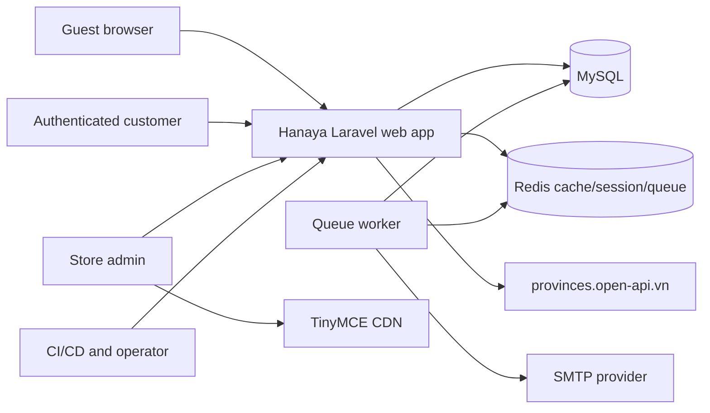
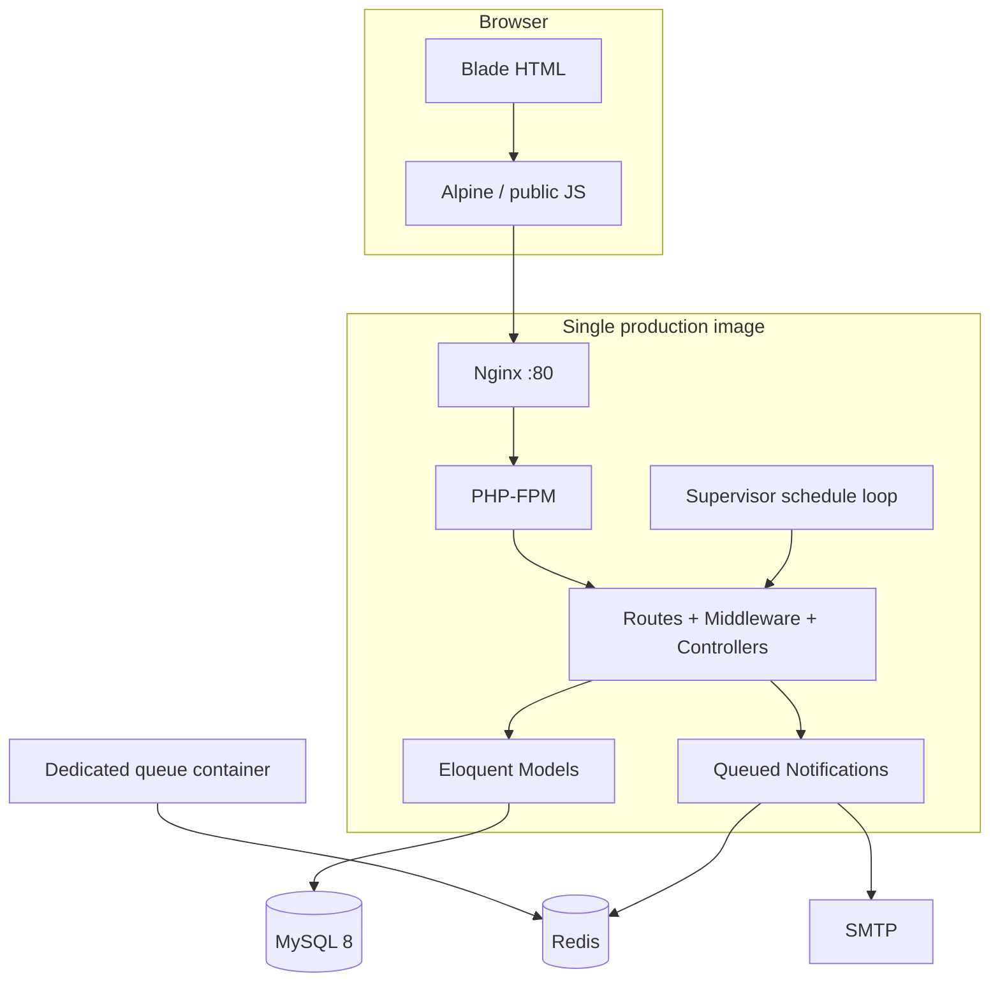
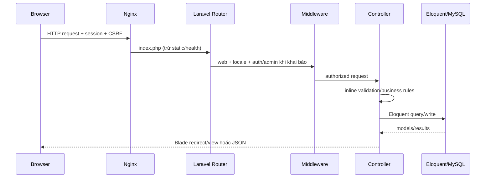

# Kiến trúc hệ thống Hanaya Shop

> Status: Canonical  
> Last verified against code: 2026-07-17  
> Primary sources: `bootstrap/app.php`, `routes/`, `app/`, `resources/`, `config/`, `database/migrations/`, `Dockerfile`, `docker-compose.production.yml`, `deployment/`, `.github/workflows/`

## 1. Architecture overview

Hanaya Shop là modular Laravel monolith theo HTTP server-rendered architecture. Route gọi controller; controller trực tiếp validate, query Eloquent, điều phối transaction, filesystem và notification. Chỉ payment simulation được tách vào `app/Services/PaymentService.php`; không có repository/use-case/adapter layer nhất quán.

## 2. System context diagram

Province API và TinyMCE được browser gọi trực tiếp; diagram dùng mũi tên qua `Web` theo context UI ownership, không hàm ý server adapter.

## 3. Container/component diagram

`Dockerfile` image tự chạy Nginx, PHP-FPM, hai queue workers và scheduler qua Supervisor. `docker-compose.production.yml` còn tạo một `queue` container từ cùng image với command override, dẫn tới khả năng worker bị chạy trùng tùy Supervisor/CMD behavior.

## 4. Runtime architecture

- Entry HTTP: `public/index.php` → `bootstrap/app.php` → `routes/web.php`.
- Route modules: `routes/user.php`, `routes/admin.php`, `routes/auth.php`.
- Middleware global web append: `app/Http/Middleware/SetLocale.php`.
- Auth: Laravel session/cookie `web` guard; session default `database` trong `config/session.php`.
- Persistence: Eloquent models; query/business logic trực tiếp trong controllers.
- Assets: Vite builds `resources/css/app.css` và `resources/js/app.js`; nhiều scripts nằm sẵn ở `public/js/`.
- Upload: direct move vào `public/images/{products,categories,posts,reviews}`; không dùng filesystem abstraction.
- Async: notifications implement `ShouldQueue`; queue default `database`, production compose đặt Redis.
- Schedule: Supervisor gọi `schedule:run` mỗi phút nhưng `php artisan schedule:list` xác nhận không có scheduled task.

## 5. Request lifecycle

Exceptions chưa có custom handler trong `bootstrap/app.php`; Laravel defaults quyết định HTML/JSON error. Một số controllers catch `Throwable` và trả chi tiết file/line, không phù hợp production.

## 6. Authentication and authorization architecture

- `routes/auth.php` tách `guest` và `auth` groups.
- Login validation/rate limiting ở `app/Http/Requests/Auth/LoginRequest.php`.
- Admin group dùng `auth` + concrete middleware class `IsAdmin`; chỉ role exact `admin` được qua.
- `CheckRole.php` có generic role check nhưng không được route runtime sử dụng.
- Customer resource authorization là query scope thủ công. `OrderController@show` scope đúng; `cancel` và `receive` không scope, là security defect.
- Registration verification là custom session-token flow, không dùng standard signed verification URL/event dù còn `EmailVerificationNotificationController` từ Breeze.

## 7. External integrations

| Integration | Boundary | Actual behavior | Status/risk |
| --- | --- | --- | --- |
| SMTP | Laravel Mail/Notification | Registration, reset, order event mail | External setup pending; queued. |
| TinyMCE CDN | `resources/views/layouts/admin.blade.php`, editor components | Admin rich text + upload endpoints | Key hard-code; rotate and env-inject. |
| Province API | checkout Blade JavaScript | Address selection data | Direct browser dependency, no timeout/fallback contract documented. |
| Card/PayPal | `PaymentService`, payment Blade | Local simulated success | Mock only; no external API/webhook/signature. |
| Chatbot | `ChatbotController` | Keyword matching and local DB queries | Demo only; no LLM. |
| Docker Hub | workflows/compose | Build/pull `assassincreed2k1/hanaya-shop` image | Requires repository secrets and external verification. |

## 8. Background processing

All order/password notification classes implement `ShouldQueue`. Channels are `mail`, `database` hoặc cả hai. `docker-compose.production.yml` starts a dedicated worker for queues `notifications,emails,default`; notification classes do not explicitly call `onQueue`, nên mặc định vào `default`. Supervisor workers run `queue:work redis`.

Risks:

- `after_commit=false`; checkout dispatches notifications inside transaction. Worker có thể run trước commit hoặc send mail cho rolled-back order.
- Migration có `jobs` nhưng không có `failed_jobs`/job batches, trong khi default failed driver là database.
- Supervisor và compose queue command không thống nhất retry/timeout/worker count.
- Scheduler container process chạy nhưng không có job.

## 9. Error handling strategy

- Validation dùng Laravel redirect errors/422 JSON tùy request.
- `findOrFail` tạo 404.
- `IsAdmin`/ownership failures tạo 403/404 khi được implement.
- Checkout và order mutation wrap `try/catch` và redirect flash errors.
- `DashboardController` nuốt mọi exception thành zero stats, làm giảm observability.
- `AddressController` và notification test endpoint trả exception file/line; cần loại bỏ khỏi production response.
- Không có application-wide typed error envelope.

## 10. Transaction boundaries

| Flow | Boundary | Gaps |
| --- | --- | --- |
| Checkout | Order + details + stock decrement + notifications dispatch + payment record + cart delete | Client-trusted values; no row lock; notification before commit. |
| Customer cancel | Payment intent + stock restore + order status + notification | Payment collection bug, no owner/state/idempotency. |
| Admin cancel | Payment failed + stock restore + status + notifications | No prior-state/idempotency; repeat can add stock repeatedly. |
| Admin paid | Payment status + notifications | Order status không đổi; sends “completed” customer notification. |
| Confirm/shipped/receive | Không transaction | Single order update plus notifications (confirm/shipped) without transition guard. |

## 11. Multi-tenancy strategy

Không có multi-tenancy. Mọi catalog/order/admin record thuộc cùng một shop; không có `tenant_id`, tenant middleware hay scoped connection.

## 12. Security boundaries

- Internet → Nginx: security headers/CSP/rate limit trong `deployment/nginx/default.conf`; HTTPS termination không nằm trong container config.
- Browser → Laravel: session cookie + CSRF cho web forms; GET endpoints hiện thay đổi order state (`order/cancel`, `order/receive`), vi phạm safe-method semantics.
- User → admin: `IsAdmin` server middleware.
- App → DB/Redis/SMTP: env/config; một số deployment scripts hard-code credentials.
- Upload → public filesystem: MIME validation có nhưng file public ngay, không malware scan/content disarm.
- Repository boundary hiện bị vi phạm bởi committed SQL dump có PII/password hashes và hard-coded key/credentials.

## 13. Architectural risks / technical debt

1. Controller-heavy architecture gây coupling HTTP, domain, persistence, files và notifications.
2. Không có authoritative server-side pricing/cart snapshot ở checkout.
3. Order lifecycle không được đóng gói thành state machine/service; transition và idempotency phân tán.
4. Direct local upload không tương thích immutable/multi-instance deployment nếu volume không shared.
5. Cache keys tạo theo hour/query nhưng mutation invalidation không khớp các key động.
6. Registration verification phụ thuộc session/device.
7. Hai production workflows cùng trigger `main` và nhiều deployment compose/script khác nhau gây ambiguity.
8. Runtime image/process topology có nguy cơ duplicate workers.
9. Framework/default config hỗ trợ nhiều integrations nhưng không có adapter/app-specific contract.

## 14. Important architectural decisions

| ID | Observed decision | Consequence |
| --- | --- | --- |
| ADR-001 | Laravel modular monolith + Blade SSR | Deployment đơn giản; controller/domain coupling cao. |
| ADR-002 | MySQL là primary DB | Migrations có MySQL enum/fulltext/charset statements; SQLite không tương đương. |
| ADR-003 | Session-based authentication | Phù hợp web UI; không có token API. |
| ADR-004 | Redis intended cho production cache/session/queue | Compose/config naming drift phải được sửa trước production. |
| ADR-005 | Database + mail queued notifications | Cần worker, failed job schema và after-commit policy. |
| ADR-006 | Public local image storage | Phải persist/mount `public/images`; scaling cần shared/object storage. |
| ADR-007 | Payment UI/records là demo | Không được dùng như evidence thanh toán thật. |

Các quyết định cần chốt thêm nằm ở [`09_ROADMAP_AND_DECISIONS.md`](09_ROADMAP_AND_DECISIONS.md).
