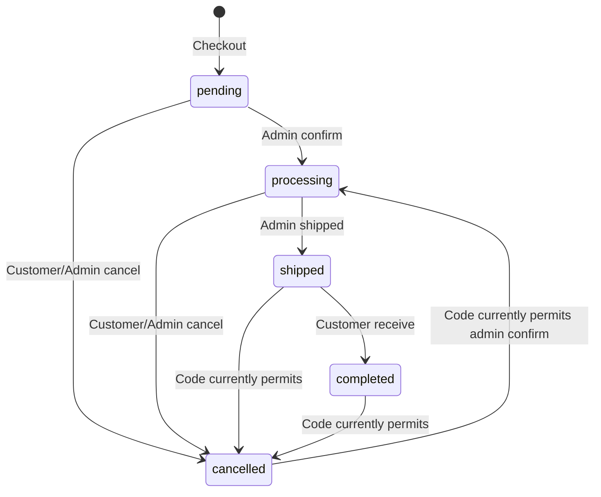
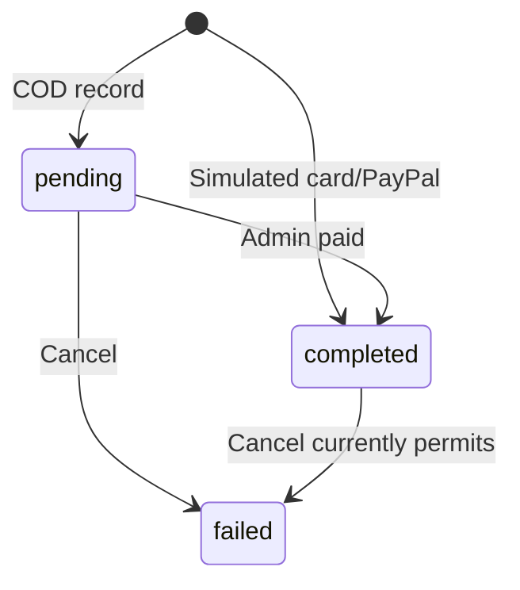
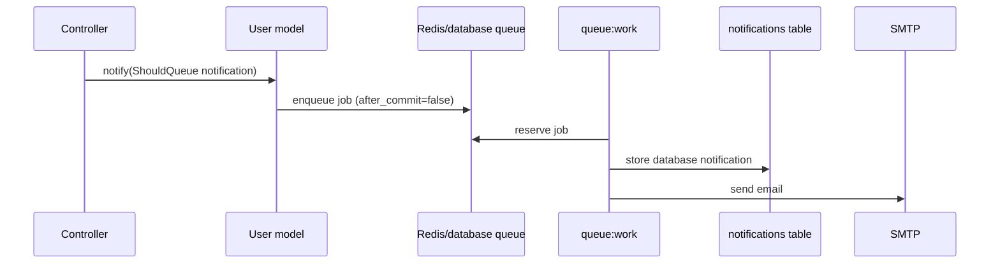

# Domain và flow nghiệp vụ Hanaya Shop

> Status: Canonical  
> Last verified against code: 2026-07-17  
> Primary sources: `app/Models/`, `app/Http/Controllers/User/`, `app/Http/Controllers/Admin/OrdersController.php`, `app/Services/PaymentService.php`, `app/Notifications/`, `config/constants.php`, `database/migrations/`, `resources/views/page/`

## 1. Domain overview

Core domain là catalog → cart → checkout → order → fulfillment → review. Supporting domains gồm identity/profile/address, content/post, notification và admin reporting. Coupon classes tồn tại nhưng rỗng và không thuộc runtime domain.

## 2. Core entities

| Entity | Meaning / important attributes | Relations and lifecycle | Invariants actually enforced | Sources |
| --- | --- | --- | --- | --- |
| User | Identity với `name`, unique `email`, hashed password, role | Has orders, reviews, carts, posts, addresses, notifications | DB role enum `user/admin/manager`; admin middleware chỉ nhận `admin` | `app/Models/User.php`, users migration |
| Category | Nhóm product, name unique, optional image/description | Has many products; delete cascades products | Unique name | `app/Models/Product/Category.php`, category migration |
| Product | Catalog item: price, discount %, stock, view count, image | Belongs category; has order details/carts/reviews | price/stock validation ở admin UI; DB không check nonnegative | `app/Models/Product/Product.php`, product migrations |
| Cart | Selected product quantity cho user/session | Belongs product/user | Không có unique product+owner; controller kiểm tra stock không atomically | `app/Models/Cart/Cart.php`, carts migration |
| Address | Shipping contact/location | Belongs user; order optionally refers address | Create route assigns current user; checkout chỉ `exists`, không owner check | `app/Models/Address.php`, addresses migration |
| Order | Purchase aggregate với total, status, message, user/address | Has details, payment(s), reviews | Status DB enum; transition graph không enforce | `app/Models/Order/Order.php`, orders migrations |
| OrderDetail | Historical line item quantity + unit price + nullable subtotal | Belongs order/product | Product/order FKs; no unique pair; controller không populate `subtotal` | `OrderDetail.php`, order details migrations |
| Payment | Local payment attempt/status/transaction ID | Belongs order; model exposes one and many relations | Method/status DB enums; transaction ID unique; không unique order_id | `Payment.php`, `PaymentService.php`, payments migration |
| Review | Rating/comment/image for bought product/order | Belongs user/product/order | Unique triple; controller enforces completed order and product membership | `Review.php`, reviews migration, `ReviewController.php` |
| Post | Store article with published flag and author | Belongs user; images stored on disk | Slug unique; public query `status=true` | `app/Models/Post.php`, posts migration |
| Notification | Laravel polymorphic persisted message | Belongs morphic notifiable, usually User | UUID PK; read state by `read_at` | notifications migration, `app/Notifications/` |

## 3. Domain terminology

- “Top seller” trên homepage dùng tổng `order_details.quantity` của mọi order status; admin “best selling” lại dùng `view_count`.
- “Sale” là `discount_percent > 0`; final displayed price do model/UI tính, không lưu riêng.
- “Paid” là `payments.payment_status=completed`; không có external settlement proof.
- “Completed” là order customer nhận hàng; dashboard chỉ cộng revenue từ status này.
- “Published” là boolean `posts.status=true`.

## 4. State machines

### Intended/observed order states



Các mũi tên “code currently permits” là defect, không phải desired behavior. Controllers không kiểm tra previous state. Review chỉ được tạo khi `completed`.

### Payment states



Không có `refunded` trong DB dù comment model đề cập.

## 5. Main user flows

### Flow F-01: Browse product

- Actor: guest/customer.
- Trigger: `GET /products` hoặc alias `/product`.
- Main path: `routes/user.php` → `User/ProductController@index` → Eloquent product/category/review aggregate → cache 15 phút → `resources/views/page/products/index.blade.php`.
- Filters: `q`, `category`, `category_name`, `sort`, `page`.
- Side effects: index không write; detail `GET /products/{id}` increment `view_count`.
- Error: invalid product → 404.
- Risk: detail cache giữ stale model, view count increment không đổi cached instance; mutation cache invalidation thiếu.

### Flow F-02: Add cart

- Actor: authenticated user (route-level precondition).
- Trigger: `POST /cart/add/{id}` hoặc `POST /cart` buy-now.
- Main path: load Product → compare requested/current quantity với stock → create/update Cart → redirect.
- DB changes: insert/update `carts`; buy-now redirects cart.
- Alternative: out of stock → flash error.
- Risk: quantity không validate integer/positive; query existing item bằng session ID thay vì user ID; concurrent adds không lock; buy-now không check accumulated quantity.

### Flow F-03: Checkout and simulated payment

- Actor: authenticated user có address và selected cart items.
- Trigger: `POST /checkout-preview`, sau đó `POST /checkout`.
- Main path:
  1. Browser serializes selected rows vào `selected_items_json`.
  2. Preview tin `stock_quantity` từ payload và lưu toàn bộ payload vào session.
  3. Checkout page lấy addresses của user và payment method list.
  4. Store validates address exists + payment method enum.
  5. Transaction creates Order from client subtotal + fixed shipping fee.
  6. Với mỗi client item: load Product by `id`, decrement stock, create OrderDetail using client `price`.
  7. Dispatch admin/customer notifications.
  8. `PaymentService` creates local Payment: COD pending; card/PayPal completed.
  9. Delete cart IDs scoped by user, commit, clear session.
- External calls: none for payment; notification mail is queued.
- Error: rollback DB and redirect with exception message appended.
- Critical gaps: no payload schema; no address ownership; no DB price/subtotal recomputation; no stock recheck/lock; null Product dereference possible; notifications before commit; no idempotency key.

```mermaid
sequenceDiagram
    actor U as User
    participant UI as Checkout Blade/Alpine
    participant C as CheckoutController
    participant DB as MySQL
    participant P as PaymentService
    participant Q as Queue
    U->>UI: Select cart rows/payment
    UI->>C: POST checkout (client price/subtotal/items)
    C->>DB: BEGIN; create order/details; decrement stock
    C->>Q: Queue mail/database notifications
    C->>P: processPayment()
    P->>DB: create local payment record
    C->>DB: delete carts; COMMIT
    C-->>U: redirect checkout/success?order_id=
```

### Flow F-04: Order fulfillment

- Actor: admin.
- Main path: `pending` → confirm endpoint sets `processing` → shipped endpoint sets `shipped`; each sends admin/customer notification.
- Paid endpoint marks first Payment completed but không update Order status; customer receives `CustomerOrderCompletedNotification` naming mismatch.
- Cancel endpoint marks payment failed, restores each product stock, sets cancelled, sends notifications, all in transaction.
- Error: redirect with localized error + raw exception suffix.
- Gap: no transition guard/idempotency; repeated cancel restores stock repeatedly.

### Flow F-05: Customer order actions

- Actor: authenticated user.
- List/detail: correctly filter `orders.user_id = Auth::id()`.
- Cancel: `GET /order/cancel/{id}` loads global order, attempts payment collection property write, restores stock and sets cancelled.
- Receive: `GET /order/receive/{id}` loads global order and sets completed.
- Critical gap: cancel/receive lack owner check; both mutate through GET; no transition guard.

### Flow F-06: Review

- Actor: authenticated user.
- Preconditions: order belongs user, product belongs order, order status equals `config('constants.review.can_review_status')` (`completed`), no existing unique triple.
- Main path: form → validation → optional image move → business checks → Review create.
- DB changes: insert review.
- Alternative/error: redirects with business message.
- Risk: image is moved before business authorization checks; rejected review can leave orphan file.

### Flow F-07: Registration verification

- Actor: guest.
- Main path: validate strong password → hash and store pending record/token in session → synchronous `Mail::send` verification email → same-session token link → create verified User → login.
- Alternative: missing session redirects register; token expires after 24h; resend has no explicit throttle.
- External call: configured mail transport.
- Risk: link opened in another browser/device lacks pending session; pending email uniqueness can race until verification.

### Flow F-08: Admin CRUD/content upload

- Actor: admin (`auth` + `IsAdmin`).
- Category/product/user/post controllers validate then call Eloquent directly.
- Images move/delete under `public/images/*`; post model and controller both implement deletion hooks, so content image deletion responsibilities overlap.
- Search endpoints mostly return JSON containing rendered HTML fragments.
- User deletion blocks rows having `pending/processing/shipped` orders; FK cascade deletes completed/cancelled order history with user.

## 6. Additional sequence: queued notification



## 7. Business rules

| ID | Rule | Enforcement |
| --- | --- | --- |
| BR-001 | Category name unique | DB + admin validation. |
| BR-002 | Product price/stock nonnegative, discount 0..100 | Admin validation only; DB lacks checks. |
| BR-003 | Cart requested quantity must not exceed stock | Controller check, non-atomic; positive/integer not enforced. |
| BR-004 | Shipping fee is fixed at `config('constants.checkout.shipping_fee')` | Checkout total; default `8`. Currency unspecified. |
| BR-005 | Payment methods: COD/card/PayPal | Request validation + model create hook + DB enum. |
| BR-006 | Card/PayPal are immediately completed | Demo `PaymentService`; not real settlement. |
| BR-007 | Order statuses are pending/processing/shipped/completed/cancelled | DB enum + constants. Transition graph not enforced. |
| BR-008 | Review allowed only on completed owned order/product | Controller + unique DB triple. |
| BR-009 | Admin may not edit/delete self via user admin CRUD | Controller. Profile endpoint still allows self-edit/delete. |
| BR-010 | User with active order cannot be deleted by admin | Controller defines active as pending/processing/shipped. |
| BR-011 | Public posts require `status=true` | Public PostController and homepage query. |
| BR-012 | Admin access requires exact role `admin` | `IsAdmin.php`. |

## 8. Edge cases

- Empty/invalid JSON checkout items; client item missing `id`, `quantity`, `price`, `subtotal`, `cart_id`.
- Negative/decimal cart quantity; duplicate cart rows.
- Stock changes between preview and store; simultaneous checkout over-sells.
- Address belonging to another user.
- Repeated cancel/receive/confirm/shipped/paid requests.
- Order without payment (show tolerates; customer cancel does not correctly).
- User deletion cascades historical orders/reviews/posts.
- Category deletion cascades product/order detail/cart/review data through FK chain.
- Registration mail failure leaves pending session; verified email race.
- Uploaded filenames based on second timestamp may collide for category/product.

## 9. Consistency and idempotency rules

Current guaranteed atomicity is limited to explicit transactions described above. There is no request idempotency key, optimistic version, DB row lock or unique payment-per-order constraint. Desired minimum:

- Checkout must derive line price/discount/stock from locked DB rows and accept an idempotency key.
- Cancel must be allowed once from declared states; stock restoration must be tied to a durable transition.
- Notification jobs should dispatch after commit and tolerate duplicate delivery.
- Payment callbacks, when implemented, must verify signature and deduplicate provider event/transaction IDs.

## 10. Mock/demo flows

- Card form performs client-side validation/delay, sends only last digits/metadata and receives simulated success.
- PayPal form creates a random client “SIMULATED” reference; server ignores provider verification and creates its own ID.
- Chatbot uses keyword arrays and local queries, not AI.
- `/admin/test-notifications` sends real configured notifications against first DB records; it is a dangerous test endpoint if enabled in production.

