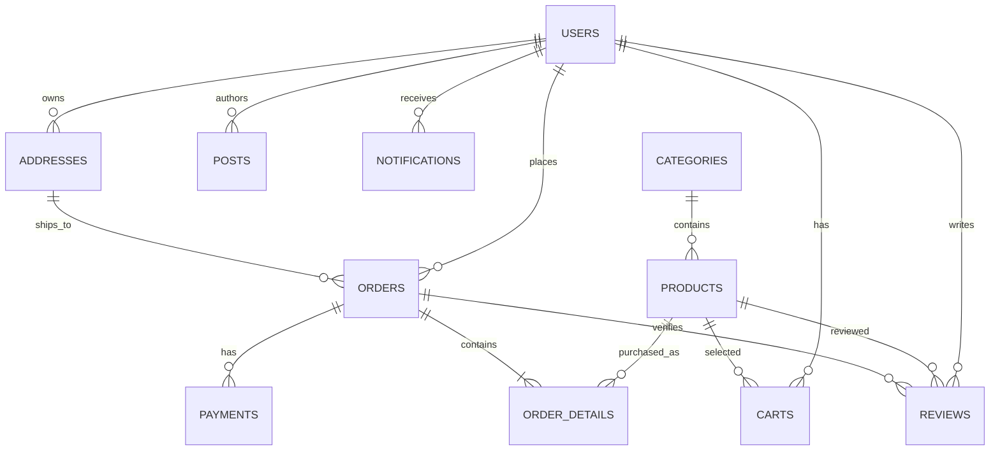

# Database Hanaya Shop

> Status: Canonical  
> Last verified against code: 2026-07-17  
> Primary sources: `database/migrations/`, `database/schema/mysql-schema.sql`, local MySQL `hanaya_shop_demo` information schema (read-only inspection), `app/Models/`, controller queries, `database/seeders/`, `database/factories/`

## 1. Database overview

Runtime mặc định dùng MySQL (`config/database.php`). Local inspection ngày 2026-07-17 xác nhận MySQL 8.0.40 và toàn bộ 21 migrations được đánh dấu ran. Không ghi credential/database URL vào tài liệu.

Ứng dụng là single-tenant. Eloquent không dùng soft delete. App tables dùng bigint IDs trừ notification UUID và string keys cho session/cache/reset token.

## 2. Source of truth

Ưu tiên schema:

1. `database/migrations/*.php` cho schema có thể tái tạo.
2. Actual target database information schema khi vận hành.
3. `database/schema/mysql-schema.sql` là snapshot, có drift.
4. `database/sql/hanaya_shop_2025-09-30_10-42-44.sql` là data dump nhạy cảm, không phải schema source và không được dùng làm seed mặc định.

Local drift đã xác minh: actual `posts.title`, `slug`, `content` nullable dù create migration khai báo non-null. Cần migration reconciliation mới; không sửa migration đã chạy.

## 3. Entity relationship diagram



## 4. Table catalog

### Business tables

| Table | Purpose and key columns | Keys/constraints/indexes | Ownership/audit/delete | Source |
| --- | --- | --- | --- | --- |
| `users` | identity: `name`, `email`, `email_verified_at`, `password`, `role` | PK `id`; unique `email`; enum role `user/admin/manager` | timestamps; no soft delete | `0001_01_01_000000_create_users_table.php` |
| `categories` | catalog grouping: unique `name`, description, image | PK; unique name | timestamps; deleting cascades products | `2025_04_11_223941_create_categories_table.php` |
| `products` | name, descriptions, price, discount, stock, view count, image, category | FK category cascade; indexes on category/price/discount/view/created and composites; MySQL fulltext name+descriptions | timestamps; no soft delete | create + 3 product migrations |
| `addresses` | phone/address + optional lat/lng | FK user cascade; index user | user-owned; timestamps | `2025_06_20_084648_create_addresses_table.php` |
| `orders` | total, status, message, user, optional address | PK; FK user cascade; FK address set null; indexes FKs; status enum | user-owned; timestamps | create + address/message + remove discount migrations |
| `order_details` | quantity, unit `price`, nullable `subtotal`, product/order | FKs both cascade; no unique order+product | owned through order; timestamps | create + subtotal migrations |
| `payments` | method, status, optional unique transaction ID, order | FK order cascade; transaction ID unique; no unique order ID | owned through order; timestamps | `2025_06_21_150638_create_payments_table.php` |
| `reviews` | rating, comment, image, product/order/user | three cascade FKs; unique `(user_id,product_id,order_id)` | user-owned; timestamps | create + FK fix migration |
| `carts` | product, nullable user/session, quantity | FKs product/user cascade; no owner/product unique; session not indexed | user/session ownership; timestamps | `2025_06_26_152041_create_carts_table.php` |
| `posts` | title, unique slug, content, image, status, author | FK user cascade; unique slug | author-owned; timestamps; actual local nullability drift | create + charset migration |

### Framework/infrastructure tables

| Table | Purpose | Important schema/risk | Source |
| --- | --- | --- | --- |
| `password_reset_tokens` | Password broker token by email | email PK, token, nullable created_at | users migration + remove-user-id migration |
| `sessions` | Database sessions | string PK, nullable indexed user_id (không FK), indexed last_activity, payload | users migration |
| `cache` | Database cache | string PK key, value, expiration | cache migration |
| `cache_locks` | Atomic cache locks | key PK, owner, expiration | cache migration |
| `notifications` | Laravel database notifications | UUID PK, polymorphic type/id index, text data, nullable read_at | notifications migration |
| `jobs` | Database queue | bigint PK, queue index, payload/attempt/timestamps | jobs migration |
| `migrations` | Laravel migration ledger | generated by framework | framework |

`failed_jobs` và `job_batches` không có migration, dù `config/queue.php` default failed driver dùng database table `failed_jobs`.

## 5. Enum and status definitions

| Field | Values | Default / code usage |
| --- | --- | --- |
| `users.role` | `user`, `admin`, `manager` | `user`; admin routes exact `admin`, manager unused. |
| `orders.status` | `pending`, `processing`, `shipped`, `completed`, `cancelled` | `pending`; constants mirror exact values. |
| `payments.payment_method` | `credit_card`, `paypal`, `cash_on_delivery` | Model attribute says COD, DB has no default. |
| `payments.payment_status` | `pending`, `completed`, `failed` | `pending`; no refunded. |
| `posts.status` | boolean | true/published. |

Rating range 1..5 chỉ được request validation enforce; DB `tinyint` default 5 không có check constraint.

## 6. Data lifecycle

- Category delete → products cascade → carts/order_details/reviews cascade. Vì order_details cascade theo product, xóa catalog có thể làm mất line history.
- User delete → addresses/orders/reviews/posts/carts cascade; order delete tiếp tục xóa details/payments/reviews.
- Address delete → existing order `address_id` set null.
- Product image/post/review image file lifecycle không nằm trong transaction với DB.
- Không có archival/retention/soft-delete policy.

## 7. Transaction behavior

Checkout và cancel flows dùng manual `DB::beginTransaction/commit/rollBack`; xem [`03_DOMAIN_AND_FLOWS.md`](03_DOMAIN_AND_FLOWS.md). DB constraints bảo vệ references/unique IDs nhưng không bảo vệ stock, total calculation hoặc state transition. Không dùng `SELECT ... FOR UPDATE`.

## 8. Tenant isolation

Không có tenant ownership. Tất cả rows thuộc một logical shop. User-level isolation dựa vào query `user_id` trong controller, không có global scope/policy.

## 9. Seed and demo data

| Source | Type | Behavior / caution |
| --- | --- | --- |
| `database/seeders/DatabaseSeeder.php` | Development seed | 5 category factories, 50 products, 20 random users, 10 posts. Không tạo address/order/payment đồng bộ. |
| `database/seeders/ProductSeeder.php` | Ad-hoc test seed | Hai test products; không được `DatabaseSeeder` gọi. |
| `database/factories/` | Test/dev fixture | User role random gồm manager; factory password là known test value, không dùng production. |
| `database/sql/sample_data.sql` | Near-empty legacy artifact | Không cung cấp canonical seed. |
| `database/sql/truncate_data.sql` | Destructive helper | Tắt FK checks và truncate product/category; không chạy ngoài disposable DB. |
| `database/sql/hanaya_shop_2025-09-30_10-42-44.sql` | Sensitive historical dump | Chứa PII và password hashes. Không import mặc định; rotate/revoke affected credentials và purge history theo incident plan. |

README còn publish demo account credentials; không coi là trusted seed vì seeder hiện không tạo các account đó.

## 10. Migration workflow

1. Đọc `docs/project/04_DATABASE.md` và toàn bộ migrations liên quan.
2. Xác minh active DB là disposable/test trước mọi test hoặc migrate destructive.
3. Tạo migration mới; không sửa migration đã applied.
4. Update model/controller/fixture/test/doc đồng bộ.
5. Chạy `php artisan migrate:status`, migrate trên test DB, test rollback riêng khi an toàn.
6. Production chỉ chạy `php artisan migrate --force` sau backup verified và review backward compatibility.

Critical preflight vì incident 2026-07-17:

```bash
php artisan config:clear
php artisan test tests/Unit/ConfigurationTest.php --filter=test_laravel_uses_testing_environment
```

Chỉ tiếp tục nếu output exact `environment: testing` và `Database: hanaya_shop_test` (hoặc disposable DB được phê duyệt). Test guard hiện tại vẫn chấp nhận demo DB nên cần sửa trước khi tin tự động hóa.

## 11. Backup and restore assumptions

Repo có shell scripts dùng `mysqldump` và compose volume `db_data`, nhưng credential hard-code và target names không nhất quán. Không có evidence restore drill, retention, encryption, offsite storage hoặc RPO/RTO. TODO: Chưa thể xác minh backup production từ repository hiện tại.

## 12. Known database risks

1. Checkout total/unit price tin client; order integrity không do DB đảm bảo.
2. Stock update read-modify-write không lock/check, có thể oversell/negative.
3. Cart thiếu unique/index theo `(user_id, product_id)` hoặc `(session_id, product_id)`.
4. Payments cho phép nhiều rows/order nhưng business code thường lấy `first()`.
5. `order_details.subtotal` tồn tại nhưng không được write, gây schema/model drift.
6. Cascade delete product/user phá historical order/reporting data.
7. Order status thiếu transition/audit history và idempotency marker.
8. Posts actual schema nullable khác migrations.
9. `sessions.user_id` không có FK; orphan session có thể tồn tại.
10. `failed_jobs` thiếu trong khi queue failed driver hướng database.
11. SQL dump nhạy cảm đã commit; Git history vẫn chứa dữ liệu dù xóa file ở commit sau.
12. Tests từng chạy vào demo DB do config cache; guard intentionally accepts unsafe DB.
